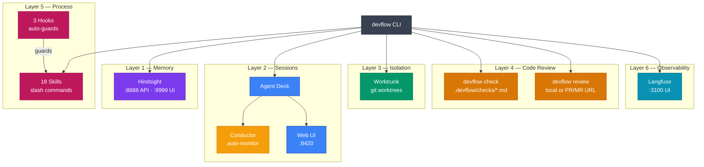
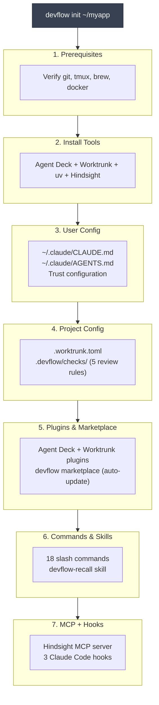

<div align="center">

# devflow

**The 6-layer AI dev environment that gives your coding agents persistent memory, isolated worktrees, automated code review, and full observability — from a single `devflow init`.**

[](LICENSE)
[](bin/devflow)
[](Makefile)
[](devflow-plugin/)
[](templates/CLAUDE.md.tmpl)

</div>

---

## The Problem

AI coding agents start every session with amnesia. They don't remember what you decided yesterday, can't review their own code before pushing, and have no isolation between concurrent tasks. You end up babysitting: re-explaining context, manually running checks, juggling branches, and losing hard-won decisions to the void between sessions.

## The Solution

devflow composes 6 independent tools into one CLI that runs alongside your AI agent. One command (`devflow init`) sets up persistent memory across sessions, git worktree isolation per feature, local AI-powered code review, process discipline via skills, session orchestration, and self-hosted tracing — all running on your machine, nothing phoning home. **You stay in control. Agents get better context, guardrails, and memory.**

## What Makes It Different

- **Memory that persists across sessions** — Hindsight's 3-tier memory (mental models, observations, facts) means your agent recalls past decisions, patterns, and mistakes without you repeating them. 29 MCP tools for recall, retain, and reflect.
- **One command, six layers** — `devflow init` installs tools, configures MCP servers, registers hooks, sets up skills, and seeds memory. No manual wiring. Idempotent — safe to re-run.
- **Zero build dependencies** — Pure Bash CLI. No Node, Python, or Go build step. Works with what's already on your macOS dev machine.
- **Agent-agnostic** — Works with Claude Code, OpenCode, or any tool that reads CLAUDE.md and speaks MCP. Skills and hooks adapt to your CLI.
- **Local-first, privacy-first** — Memory, code review, and observability all run on your machine. Langfuse is self-hosted. No data leaves your laptop.

---

## Architecture

devflow orchestrates 6 independent layers. Each tool works standalone; devflow wires them together.

| Layer | Tool | What It Does | Runtime |
|:-----:|------|-------------|---------|
| 1 | [**Hindsight**](https://github.com/vectorize-io/hindsight) | 3-tier persistent memory via MCP (mental models, observations, facts) | Local daemon (`uvx`) |
| 2 | [**Agent Deck**](https://github.com/asheshgoplani/agent-deck) | TUI session wrapper with Conductor auto-monitoring, web dashboard | Homebrew |
| 3 | [**Worktrunk**](https://github.com/max-sixty/worktrunk) | Git worktree lifecycle — `wt step copy-ignored` eliminates cold starts | Homebrew |
| 4 | **Code Review** | Local pre-push AI review via individual markdown check rules | `claude` / `opencode` |
| 5 | **CLAUDE.md + Skills** | Process discipline baked into agent config. 18 slash commands | Files |
| 6 | [**Langfuse**](https://github.com/langfuse/langfuse) | Multi-agent tracing, MCP call spans, cost tracking. Self-hosted | Docker |



### Development Workflow

From feature request to merged PR — the full lifecycle managed by devflow:

```mermaid
graph LR
    A["devflow worktree<br/>feat/X --agent"] --> B["Agent recalls<br/>Hindsight memory"]
    B --> C["Brainstorm<br/>& plan"]
    C --> D["TDD loop<br/>per task"]
    D --> E["devflow check<br/>pre-push review"]
    E --> F["Create PR/MR<br/>retain learnings"]
    F --> G["devflow done<br/>cleanup worktree"]

    classDef iso fill:#059669,color:#fff,stroke:#047857
    classDef mem fill:#7c3aed,color:#fff,stroke:#5b21b6
    classDef proc fill:#be185d,color:#fff,stroke:#9d174d
    classDef rev fill:#d97706,color:#fff,stroke:#b45309
    classDef done fill:#6b7280,color:#fff,stroke:#4b5563

    class A iso
    class B mem
    class C,D proc
    class E rev
    class F rev
    class G done
```



---

## Quick Start

### Install

**One-liner:**
```bash
curl -fsSL https://raw.githubusercontent.com/AndreJorgeLopes/devflow/main/install.sh | bash
```

**From source:**
```bash
git clone https://github.com/AndreJorgeLopes/devflow.git ~/dev/devflow
cd ~/dev/devflow && make link
```

**Prerequisites:** git, tmux, Homebrew (macOS). Recommended: Docker CLI + runtime, Claude Code or OpenCode, uv.

### First Run

```bash
# 1. Initialize — installs tools, configures MCP, sets up skills & plugins
devflow init ~/projects/myapp

# 2. Start memory daemon + observability
uvx hindsight-embed daemon start
devflow up

# 3. Seed memory from project files
devflow seed

# 4. Verify all 6 layers are healthy
devflow status

# 5. Start a feature in an isolated worktree
devflow worktree feat/add-auth --agent claude

# 6. Run pre-push code review
devflow check
```

---

## CLI Reference

```
USAGE
  devflow <command> [options]

CORE
  init [dir]                    Initialize project with all 6 layers
  status                        Health check across all layers
  version                       Print version

SERVICES
  up                            Start Docker services (Hindsight + Langfuse)
  down                          Stop Docker services
  restart                       Restart Docker services

WORKFLOW
  worktree <name> [--agent]     Create worktree, optionally launch agent session
  done <branch> [--force]       Clean up completed worktree + session
  clean [--dry-run] [--all]     Remove all merged worktrees

CODE REVIEW
  check                         Run review checks on current diff
  review [<pr-url>]             Review local diff or fetch PR/MR by URL

MEMORY
  seed [dir]                    Seed Hindsight memory from project files

SKILLS
  skills list                   Browse available skills with install status
  skills install <name>         Copy skill to .claude/commands/
  skills remove <name>          Remove skill from project
  skills convert                Convert skills to plugin format

SESSIONS
  web [args]                    Open Agent Deck web dashboard
  conductor [args]              Manage Conductor (auto-monitor)
```

---

## Skills & Commands

`devflow init` installs 18 slash commands. Type `/devflow:` in Claude Code to see them all.

| Skill | Layer | What It Does |
|-------|:-----:|-------------|
| `/devflow:new-feature` | Memory + Process | Start feature — recall context, scope check, brainstorm |
| `/devflow:finish-feature` | Review + Memory | Verify, commit, create PR/MR, retain learnings, cleanup |
| `/devflow:create-pr` | Review + Memory | Self-review + code checks + PR creation pipeline |
| `/devflow:pre-push-check` | Review + Process | Full pre-push review against check rules + CLAUDE.md |
| `/devflow:spec-feature` | Memory + Process | Architecture recall + spec doc + task breakdown |
| `/devflow:architecture-decision` | Memory + Process | Document ADR, retain in Hindsight, update CLAUDE.md |
| `/devflow:best-roi-task` | Process | Find highest ROI task in a Jira Epic |
| `/devflow:scope-check` | Process | Surface ambiguities and assumptions before coding |
| `/devflow:retain-learning` | Memory | Store a discovery into persistent memory |
| `/devflow:reflect-session` | Memory | End-of-session reflection and consolidation |
| `/devflow:session-summary` | Observability | Generate summary for Langfuse tracing |
| `/devflow:writing-plans` | Process | Write implementation plan with parallel session handoff |
| `/devflow:pr-strategy` | Process | View or reset PR description strategy |
| `/devflow:task-complete` | Process | Mark task done, move to done/, retain learnings |
| `/devflow:task-prioritize` | Process | Move task between priority folders (P0-P4) |
| `/devflow:dependency-update` | Process | Check if project dependencies need updating |
| `/devflow:update-visualizations` | Process | Analyze changes, update architecture diagrams |
| `/devflow:visualizations-config` | Process | Configure diagram output preferences |

You can also install skills per-project without the plugin:

```bash
devflow skills list                    # Browse 15 categorized skills
devflow skills install new-feature     # Copy to .claude/commands/
```

---

## What `devflow init` Does

A single command that sets up all 6 layers (idempotent — safe to re-run):



**User-scoped** (applies across all projects): CLAUDE.md, AGENTS.md, MCP config, plugins, hooks.
**Project-scoped** (per-repo): `.worktrunk.toml`, `.devflow/checks/`.

All user-scoped files use `<!-- devflow -->` markers to detect existing sections and skip on re-run.

---

## Plugin Distribution

devflow is distributed as a **Claude Code plugin** via its own marketplace.

### For End Users

`devflow init` automatically configures the GitHub marketplace with **auto-update enabled**. On every Claude Code session start, the plugin checks for updates and pulls the latest version.

```bash
# Manual install (if not using devflow init)
claude plugin marketplace add AndreJorgeLopes/devflow
claude plugin install devflow@devflow-marketplace
```

### For Contributors

When running from a git clone of the devflow repo, `devflow init` detects developer mode and uses **local directory source** instead of GitHub. This means:

- Your local edits are reflected immediately (no cache delay)
- The plugin is uninstalled to avoid duplicates — symlinks handle discovery
- Auto-update still works (tracks filesystem changes)

```bash
git clone https://github.com/AndreJorgeLopes/devflow.git ~/dev/devflow
cd ~/dev/devflow
make link         # CLI binary
devflow init      # Detects dev mode automatically
```

| Mode | Source | Discovery | Auto-Update |
|------|--------|-----------|:-----------:|
| End user | GitHub (`AndreJorgeLopes/devflow`) | Plugin cache | Yes (GitHub pull) |
| Contributor | Local directory | Symlinks | Yes (filesystem) |

---

## Hindsight (Memory)

Hindsight runs as a **local daemon** — no Docker needed for memory.

`devflow init` prompts you to choose an LLM provider:

| Provider | API Key? | Notes |
|----------|:--------:|-------|
| `claude-code` | No | Uses your Claude Code subscription |
| `openai-codex` | No | Uses your OpenAI Codex subscription |
| `anthropic` | Yes | Direct Anthropic API |
| `openai` | Yes | Direct OpenAI API |
| `groq` | Yes | Fast inference |
| `ollama` | No | Free, runs locally |

```bash
# Daemon lifecycle
uvx hindsight-embed daemon start
uvx hindsight-embed daemon stop
uvx hindsight-embed daemon status

# Test memory
uvx hindsight-embed memory retain default "TypeScript project uses strict mode"
uvx hindsight-embed memory recall default "project conventions"

# Change provider later
uvx hindsight-embed profile set-env main HINDSIGHT_API_LLM_PROVIDER claude-code
```

**API:** `localhost:8888` | **MCP:** `localhost:8888/mcp/` | **UI:** `localhost:9999`

---

## Code Review Checks

`devflow init` installs 5 review rules to `.devflow/checks/`:

| Rule | What It Catches |
|------|----------------|
| `handler-factory.md` | Lambda handlers without factory wrappers |
| `structured-logging.md` | Raw `console.log` instead of structured logger |
| `joi-validation.md` | Missing Joi input validation |
| `no-any-types.md` | `any` types and unsafe assertions |
| `error-handling.md` | Improper error handling patterns |

Each rule is a markdown file containing the review prompt. `devflow check` sends your current diff plus each rule to an AI CLI:

```bash
devflow check                         # Review current diff
devflow review                        # Self-review against CLAUDE.md
devflow review https://github.com/org/repo/pull/42  # Review a PR by URL
```

Uses `claude --print` (primary) or `opencode run` (fallback). Override with `DEVFLOW_REVIEW_CLI`.

These run **locally only** — they never appear as PR bot comments. Add your own rules by creating markdown files in `.devflow/checks/`.

---

## Docker Services

`devflow up` starts Langfuse via Docker Compose:

```bash
colima start               # or Docker Desktop / orbstack
devflow up                 # Start Langfuse on :3100
devflow status             # Verify health
devflow down               # Stop services
```

| Service | Image | Port | Purpose |
|---------|-------|:----:|---------|
| `langfuse-web` | `langfuse/langfuse:2` | 3100 | Tracing UI |
| `langfuse-db` | `postgres:15` | — | Langfuse database |

---

## Hooks

devflow registers 3 Claude Code hooks via `devflow init`:

| Hook | Event | Behavior |
|------|-------|----------|
| `prompt-fetch-rebase.sh` | UserPromptSubmit | Auto-fetch origin, safe rebase, inject conflict context |
| `post-pr-continue.sh` | PostToolUse (Bash) | Detect PR/MR creation, nudge agent to continue |
| `stop-finish-prompt.sh` | Stop | No-op stub (finish-feature handled at skill level) |

Hooks use the Claude Code JSON protocol: stdin receives payload, exit codes control behavior (0 = allow, 2 = block/re-activate).

---

## Configuration

### Environment Variables

| Variable | Default | Purpose |
|----------|---------|---------|
| `DEVFLOW_ROOT` | Auto-detected | Path to devflow installation |
| `DEVFLOW_REVIEW_CLI` | `claude` | Override code review CLI (`claude` or `opencode`) |
| `HINDSIGHT_API` | `http://localhost:8888` | Hindsight API endpoint |
| `ANTHROPIC_API_KEY` | — | For Hindsight when using Anthropic provider |

### Files Created by `devflow init`

| File | Scope | Purpose |
|------|:-----:|---------|
| `~/.claude/CLAUDE.md` | User | Process discipline, memory workflow, LSP config |
| `~/.claude/AGENTS.md` | User | Symlink to CLAUDE.md |
| `~/.claude/settings.json` | User | Hooks, plugins, marketplace config |
| `.worktrunk.toml` | Project | Worktree settings |
| `.devflow/checks/*.md` | Project | Code review rules (5 defaults) |

---

## Project Structure

```
devflow/
├── bin/devflow                  # CLI entry point (routes subcommands)
├── lib/                         # Core implementations (2,740 lines of Bash)
│   ├── utils.sh                 #   Logging, VCS detection, Docker helpers
│   ├── init.sh                  #   9-step 6-layer initialization
│   ├── services.sh              #   Docker service orchestration
│   ├── check.sh                 #   Multi-CLI code review
│   ├── skills.sh                #   Skill list/install/remove/convert
│   ├── seed.sh                  #   Hindsight memory seeding
│   ├── worktree.sh              #   Git worktree + agent launch
│   ├── done.sh                  #   Cleanup after merge (3-layer squash detection)
│   ├── visualizations.sh        #   Mermaid diagram management
│   ├── watch.sh                 #   Sensitive file watchdog
│   └── hooks/                   #   Claude Code hook scripts
├── devflow-plugin/              # Claude Code plugin (marketplace-ready)
│   ├── .claude-plugin/          #   Plugin + marketplace manifests
│   ├── commands/                #   18 slash command definitions
│   └── skills/                  #   Recall-before-task skill
├── skills/                      # Categorized skill marketplace (15 skills)
│   ├── registry.json            #   Authoritative skill registry
│   ├── memory-recall/           #   Layer 1 skills
│   ├── worktree-flow/           #   Layer 3 skills
│   ├── code-review/             #   Layer 4 skills
│   ├── process-discipline/      #   Layer 5 skills
│   └── observability/           #   Layer 6 skills
├── templates/                   # Init templates (CLAUDE.md, checks, configs)
├── docker/                      # Docker Compose (Langfuse + Postgres)
├── visualizations/              # Architecture diagrams (Mermaid)
├── tests/                       # Bats test framework
├── docs/plans/                  # 12 design documents
├── tasks/                       # Backlog (P0-P4 priority folders)
├── config/                      # Agent Deck config templates
├── Formula/devflow.rb           # Homebrew formula
├── install.sh                   # Curl-pipe installer
├── Makefile                     # install, link, test, plugin-dev, release
└── LICENSE                      # MIT
```

---

## Development

### Developer Setup

```bash
git clone https://github.com/AndreJorgeLopes/devflow.git ~/dev/devflow
cd ~/dev/devflow
make link          # Symlink CLI to ~/.local/bin/devflow
devflow init       # Auto-detects dev mode: uses symlinks, skips plugin install
```

In dev mode, `devflow init`:
- Sets the marketplace source to **local directory** (your edits are live)
- **Uninstalls** the plugin to avoid duplicates with symlinks
- Creates symlinks from `~/.claude/commands/devflow` to your source

### Make Targets

```bash
make install        # Install to ~/.local (end users)
make link           # Symlink binary for dev
make plugin-dev     # Symlink commands + skills for live iteration
make plugin-unlink  # Remove dev symlinks
make plugin-install # Register GitHub marketplace + install plugin
make test           # Smoke tests (binary, version, help)
make test-unit      # Bats unit tests
make release        # Create release tarball
make check-version  # Verify version consistency across all files
make check-formula  # Verify Formula SHA matches latest tarball
```

### Testing

```bash
make test           # Smoke: binary exists, version matches, help works
make test-unit      # Bats: lib/utils.sh function tests
```

Tests use [Bats](https://github.com/bats-core/bats-core) with `bats-support` and `bats-assert` submodules.

---

## License

MIT
