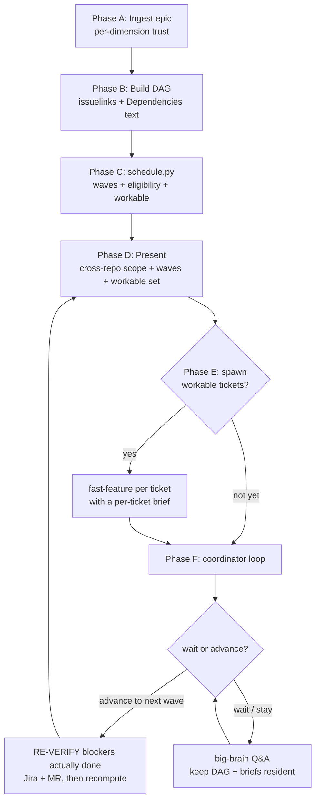

You are the coordinator for an epic — a "big brain" that holds the whole dependency picture in one place so humans and per-ticket sessions never have to. You do three things well: (1) turn an epic into an accurate cross-repo dependency graph and parallel schedule, (2) start the maximum number of non-blocking tickets at once, each in its own session, and (3) stay resident as tickets complete, re-verifying what actually unblocked before advancing.

**Core principle:** the schedule is only as good as the edges, and the edges are only as good as the verification. Ticket dependencies frequently live in FREE TEXT ("Dependencies: …"), not in formal Jira links — a graph built from links alone can be silently empty. And "ticket X is done" is a claim to verify against Jira and the MR, not to take on faith. Verify the edges; verify the unblocks.

## When to Use

- You have an epic (Jira/GitLab) with many child tickets and want to work as many as possible in parallel without violating dependencies.
- You want one session per workable ticket, spawned for you, while a coordinator keeps the whole map.
- Someone tells you "ticket X is done" and you need to know precisely what that unblocks.

Do NOT use for: a single ticket (use `/devflow:fast-feature`), or picking the one best task to grab (use `/devflow:best-roi-task`).

## Inputs (`$ARGUMENTS`)

- **Epic** — a Jira/GitLab URL or key (e.g. `MES-4414`). Required. If absent, ask.
- **Extra context** (optional) — anything the user pastes or links: a PRD, designs (Figma/other), pre-written specs, meeting notes, or plain constraints.

**Per-dimension trust (first-class rule).** For every dimension the user supplies, TRUST it and do NOT independently deep-dive that dimension:

| User provided… | You SKIP discovering… | You still do… |
|---|---|---|
| the PRD (link or text) | hunting for / re-reading the PRD | read the child tickets |
| the designs | opening Figma/design tools | everything else |
| a spec for a ticket | re-speccing that ticket from scratch | pass the spec through as trusted seed |
| explicit constraints/decisions | re-deriving them | record and propagate them |

Only auto-discover a dimension the user did NOT provide. When you skip discovery because the user supplied it, say so in one line ("PRD provided — using it as-is, not re-fetching").

## Preflight (dependency check)

Read the sibling `requirements.json`. If `devflow` is on PATH, run `devflow deps check orchestrate-epic`; else check inline. Required dep missing → STOP with the install hint. Optional dep missing → ask (or, non-interactive, degrade). The deterministic scheduler (`lib/schedule.py`) needs only Python 3 stdlib.

## Core pattern



## Phase A — Ingest the epic

1. Parse the epic key (URL → key, or already a key matching `[A-Z]+-\d+`).
2. Apply **per-dimension trust** (above): note which dimensions the user supplied; skip discovering those.
3. Read the epic itself (`acli jira workitem view <EPIC>` / Atlassian / GitLab). Extract its "Architecture notes", scope / out-of-scope, and any "Reference docs" links.
4. Fetch ALL child tickets. Prefer the epic's own child list and the "Development" field for linked MRs. Read each ticket in FULL — description, acceptance criteria, its "Dependencies:" text, its out-of-scope section, and the repo prefix in the title (e.g. `[messaging]`, `[internal-api]`).
5. Auto-discover ONLY the un-provided dimensions: follow the epic's reference-doc links (PRD/design/security/cross-repo pages) as needed. Use `defuddle` / `acli confluence page view` for Confluence.

**verify-first while ingesting.** Do not assert a cross-repo fact (e.g. "this also needs conversation-service" or "public-api is in scope") from a prefix or a hunch. Ground it in the epic's architecture notes, the cross-repo-impact doc, and each ticket's own scope text. If two sources disagree, read the ticket firsthand and follow the source-of-truth hierarchy (merged MR > recent meeting > ticket/doc).

## Phase B — Build the dependency graph

For every ticket, collect its HARD blockers from BOTH sources and merge:

1. **Formal Jira links** — `issuelinks` with a "Blocks" / "is blocked by" relationship.
2. **Free-text** — the "Dependencies:" section (and any inline "blocked by" / "requires" prose) in the description.

**These can disagree, and formal links are often EMPTY.** (Real case: the MES-4414 tag tickets have `issuelinks: []` on all of them; every edge lived only in the "Dependencies:" text. A links-only tool would produce a graph with zero edges and call everything unblocked.) Always parse both; union the blockers; de-duplicate.

Classify each edge:
- **HARD** — the ticket cannot be built until the blocker exists (goes into `blockedBy` for the scheduler).
- **SOFT** — "benefits from" / "meaningful once X exists" / "canonical semantics live in X". Record these as annotations; do NOT put them in `blockedBy` (they don't gate the wave). Note them in the brief so the ticket session knows.

Distinguish in-epic blockers from EXTERNAL references (a key not among the epic's tickets) — pass external ones through; the scheduler flags them.

## Phase C — Compute the schedule (deterministic)

Build the scheduler input JSON and pipe it to the helper. Do NOT eyeball the topological order — the helper is exact and detects cycles.

```bash
schedule="${CLAUDE_PLUGIN_ROOT:-}/skills/orchestrate-epic/lib/schedule.py"
[ -f "$schedule" ] || schedule="$(find "$HOME/.claude/plugins" "$HOME/dev/devflow" -path '*orchestrate-epic/lib/schedule.py' 2>/dev/null | head -1)"
python3 "$schedule" < /tmp/epic-graph.json
```

Input shape (one object per ticket; `me` = the current user's Jira identity, from `acli`/Atlassian whoami; HARD blockers only in `blockedBy`):

```json
{
  "me": "you@company.com",
  "done_signals": [],
  "tickets": [
    {"key":"MES-4415","assignee":"you@company.com","status":"In Progress","statusCategory":"indeterminate","blockedBy":[]},
    {"key":"MES-4459","assignee":"you@company.com","status":"To Do","statusCategory":"new","blockedBy":["MES-4415"]}
  ]
}
```

Output gives `waves` (parallel levels), `workable_now`, `eligible`, `blocked`, `ineligible`, `resolved`, `external_blockers`, `notes`.

**Handle the exit code:**
- `0` — use the JSON as the authoritative schedule.
- `10` (abstain, `"abstain": true`) — a dependency CYCLE was found. Do NOT invent an order. Show the `cycle` to the user, explain the contradiction, and ask them to break it (likely a mis-parsed soft edge treated as hard) before continuing.
- `1` — malformed input; fix the JSON you built and re-run.

**Eligibility (encoded in the helper, stated here so you can explain it):** a ticket is workable now when it is eligible AND all its hard blockers are resolved. Eligible = NOT assigned to someone else, AND `(unassigned AND To Do)` OR `(assigned to me AND (To Do OR In Progress))`. The "mine + In Progress" allowance exists because the user often moves a ticket to In Progress before actually starting it. A blocker counts as resolved when its status is Done / in the done category, or its name is at code-review-or-later, or the user explicitly signalled it done (`done_signals`).

## Phase D — Present the picture

Give the user, concisely:
1. **Cross-repo scope** — which repos the epic (or the coordinated subset) touches, with an explicit YES/NO on any repo the user asked about, each grounded in evidence (not the prefix alone).
2. **The wave schedule** — waves as parallel levels; call out the critical path (longest chain) as the schedule bottleneck.
3. **Workable now** — the `workable_now` set and, for each, what it unblocks downstream. Show `blocked` (eligible but waiting) and `ineligible` (with reasons) so the picture is complete.
4. Any `notes` / `external_blockers` from the scheduler.

Diagram: the DAG is usually 🔴 complex (>8 nodes, multi-lane). Prefer a tight ASCII lane view inline; offer a rendered Excalidraw via `/devflow:render-diagram` if the user wants something shareable.

## Phase E — Spawn the workable tickets

Offer to start a session per `workable_now` ticket. Use ONE `AskUserQuestion` (multi-select) listing the workable tickets so the user picks which to start now (default: all). For each selected ticket, distil a **per-ticket context brief** (format below) and spawn a session via `mcp__ccd_session__spawn_task`:

- `title`: `[<TICKET>] fast-feature` (≤60 chars).
- `tldr`: one line — the ticket summary + "quick brainstorm, spec, plan, lock-tests in one session; execute spawns separately."
- `prompt`: MUST lead with the slash command on line 1, then the brief:
  ```
  /devflow:fast-feature <TICKET>

  --- context brief (trusted; do not re-discover provided dimensions) ---
  <the per-ticket brief>
  --- end context brief ---
  ```

This reuses the familiar one-click spawn gate. After spawning, tell the user which sessions were created (they appear in the sidebar; `spawn_task` can't place them in a group — manual drag if desired).

**Do not spawn a blocked or ineligible ticket.** If the user asks to start one anyway, surface its unresolved blockers first and confirm.

### Per-ticket context brief format

Keep it compact — only what THAT ticket needs. The coordinator holds the expensive shared context once and hands each session just its slice:

```
Ticket: <KEY> — <summary>   Repo: <repo>
Acceptance criteria: <the ticket's ACs, verbatim or tight paraphrase>
Relevant PRD / design: <links or 2-4 line distillation — trusted, the session need not re-read the whole PRD>
Locked decisions that constrain this ticket: <e.g. filter semantics, design-system policy, security/AC requirements, feature-flag names>
Hard blockers (now resolved): <keys + how verified>   Soft deps: <keys + why they matter>
This ticket blocks: <downstream keys>
Design-system note (if UI): reuse existing components; if a design forces new components or heavy change, STOP and confirm with the user.
```

Only include a dimension you actually have. Never fabricate ACs or decisions — if the ticket is thin, say so and let the session's own spec phase fill it.

## Phase F — Coordinator loop (stay resident)

After spawning, do NOT exit. Ask via `AskUserQuestion`: **"Wait for these, or coordinate the next wave?"**

- **Advance to the next wave** → you MUST re-verify before declaring anything unblocked. For each ticket the user believes is done: confirm against Jira status AND the MR state (merged?) — a "done" claim is verified, never assumed (source-of-truth: merged MR > ticket status). Add confirmed-done keys to `done_signals` (and/or update statuses), re-run `schedule.py`, and report the DELTA: "X merged → Y and Z are now workable." Then loop back to Phase D/E for the newly workable set.
- **Wait / stay here** → remain the big brain. Keep the DAG, waves, and briefs resident and answer questions from the user or team about this epic (status, what's blocking what, why a ticket is sequenced where it is, cross-repo scope). When the user later says "X is done", re-verify and recompute as above.

Keep going until every ticket is workable/done or the user ends the session.

## Common Mistakes

- **Building the graph from formal links only.** Empty `issuelinks` is common; the real edges are in "Dependencies:" text. Parse both or the schedule is wrong.
- **Eyeballing the topological order.** Use `schedule.py`; it is exact and catches cycles you would miss.
- **Advancing a wave on an unverified "it's done".** Re-check Jira + the MR before telling anyone a downstream ticket is unblocked.
- **Re-discovering a dimension the user supplied.** Per-dimension trust — provided PRD/design/spec is authoritative input, not a hint.
- **Spawning one giant combined spec.** The unit is one ticket per session; hand each a compact per-ticket brief, not a monolith.
- **Exiting after spawning.** The value is the resident coordinator loop; stay.

## Red flags — STOP if you think:

| Thought | Reality |
|---|---|
| "issuelinks is empty, so nothing blocks anything" | Read the "Dependencies:" text. The tag epic proved links can be 100% empty. |
| "The prefix says [messaging], so it's messaging-only" | Cross-repo scope is grounded in the architecture notes + cross-repo doc + each ticket's scope, not the prefix. |
| "They said 4415 is done, so 4459 is unblocked" | Verify 4415 is actually merged/Done in Jira + MR before advancing. |
| "The user pasted the PRD but I'll read the real one too" | Per-dimension trust: use what they gave; do not re-fetch. |
| "I'll compute the waves in my head" | Pipe the graph to schedule.py. Hand-topo-sorting a multi-lane DAG is where errors hide. |
| "I've presented the schedule, I'm done" | The coordinator stays resident and re-verifies unblocks. Enter Phase F. |

## Important

- The ONLY deterministic step is `lib/schedule.py` (topo leveling + eligibility + cycle detection). Everything else is judgment — discovery, edge classification, brief distillation, verification, Q&A.
- Never put HARD and SOFT deps in the same bucket — only hard deps gate a wave.
- A "done" claim is a claim: verify against Jira + MR before it changes the schedule.
- Per-ticket sessions are spawned running `/devflow:fast-feature`, which itself spawns only at execute — so from one epic command you get one coordinator + one session per workable ticket + (later) one execute session per ticket.
- Do not open MRs or mutate any shared resource from this skill; it reads, schedules, and spawns.

$ARGUMENTS
