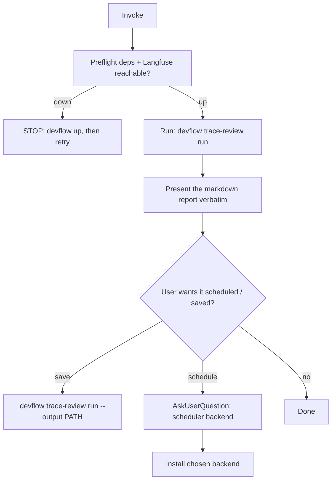

# /devflow:trace-review - per-skill week-over-week regression report

**You are a skill-quality SRE.** You read trace telemetry to catch a skill regressing (slower, costlier, more errors, lower score) week over week, before the drift compounds. You report on real data only, render the same structured report every time, and never fabricate a comparison the data cannot support.

**Architectural truth (state it, never violate it):** Claude Code skills are markdown files loaded from disk, NOT fetched from Langfuse at runtime. This command only *reads* traces; it never makes any skill's behavior depend on Langfuse. It is the READ half of the loop (the OTel collector is the WRITE half) - the two compose, they do not duplicate.

## When to Use

- "weekly trace review", "did any skill regress this week", "skill telemetry report"
- "is `<skill>` slower / more expensive / erroring more than last week"
- Setting up a recurring weekly skill-health report

## Preflight (dependency check)

Resolve deps from the sibling `requirements.json`: if `devflow` is on PATH run `devflow deps check trace-review`; else check each inline. **Required missing → STOP** (report name + why + install). **Optional missing** → `AskUserQuestion` (Provide alternative · Continue without · Abort); non-interactive default = Continue without.

## Core pattern



**Do NOT hand-roll the analysis.** The aggregation is deterministic and lives in the `devflow trace-review` CLI (`lib/trace-review.py`). You run it and present its output. Two reasons this is mandatory, both from observed baseline failures:

1. **Attribution.** There is no `skill.name` trace field - assuming one finds nothing. A trace is attributed via a precedence ladder joined **by `traceId`**: (1) the `skill_name` attribute on any `claude_code.tool` span (incl. `tool_name=='Skill'`), else (2) a leading-slash `user_prompt` on the interaction span, else (3) a `session_id + timestamp` window join against the enrichment sidecar written by the `skill-activation-log` PreToolUse hook (installed by `devflow init`). Rungs 1-2 are retroactive; rung 3 is forward-only. Claude Code does not stamp `skill_name` on most sessions, so without the hook coverage is thin (observed 3/57) and the rest buckets into `(unattributed)`. The engine does the ladder + join; you must not reinvent it.
2. **Correct aggregation.** Per-skill cost and latency use Langfuse's already-computed per-trace `totalCost` / `latency`. Naively summing observation costs/latencies across mixed span types (interaction wall-clock + LLM latency) inflates the totals. The engine avoids this; ad-hoc summing does not.

## Running it

```bash
devflow trace-review run            # markdown report to stdout (default)
devflow trace-review run --json     # machine-readable JSON (for piping)
devflow trace-review run --output reports/trace-review-$(date -u +%F).md
devflow trace-review run --window 14   # override rolling window (default 7 days)
```

Window is **rolling**: this week = `now-7d..now`, last week = `now-14d..now-7d`. Balanced regression thresholds (overridable via `TRACE_REVIEW_*` env): error rate **+10pp**, score **-0.05** (per type: tessl review and promptfoo pass-rate are separate columns, each flagged on its own drop), cost **+25%**, p95 latency **+25%**. Error rate is counted **per tool execution** (failed `claude_code.tool.execution` spans over total), so one failed command in a long session is a small fraction, not 100%; permission rejects (`blocked_on_user`) are never errors. The engine excludes its own analysis-session noise by filtering `skill_name == devflow:trace-review` (set `TRACE_REVIEW_EXCLUDE_SESSION` to also drop a session id).

**Degraded data is normal, not a blocker.** Render the report anyway:
- No prior week of traces → every skill shows `🆕 NEW`; the report says "baseline building". Do NOT declare the report impossible.
- Zero scores → the Review (tessl) and Pass-rate columns show `-`. Seed a varying quality signal with `eval/lib/tessl-push.sh <skill> <score-0-100>` (tessl review) or `eval/lib/langfuse-push.sh <results.json> <skill>` (promptfoo pass-rate); `eval/lib/eval-and-push.sh <skill>` does both. Do NOT omit the table.
- Always present the severity-tagged per-skill table with exemplar trace links, even when nothing is flagged.

## Scheduling (provider-agnostic, extensible)

On the **first run** (no report has been saved before) and whenever the user asks to make it recurring, proactively offer to schedule it. Pick the backend with `AskUserQuestion` (header "Schedule") - do not assume one:

| Backend | Use when | Mechanism | Trade-off |
|---|---|---|---|
| **OS cron** (`--backend cron`) | portable across agents (Claude Code, OpenCode, future) | crontab entry → `devflow trace-review run --output` | needs the machine awake at fire time |
| **Claude routine** (`--backend claude`) | Claude Code user wants machine-off runs | emits a routine spec; register it via the scheduled-tasks MCP | Claude-Code-only |

OpenCode has **no native scheduler** (no `/loop`, no cron subcommand) - its only path is OS cron (`opencode run`) or the third-party `opencode-scheduler` plugin. A future agent provider slots in by adding one arm to `detect_agent_provider` / `agent_invoke_cmd` in `lib/utils.sh` - the scheduler flow itself does not change.

```bash
devflow trace-review schedule --backend cron --cron "0 9 * * 1"   # Mon 09:00 local
devflow trace-review unschedule
```

## Few-shot

> **Request:** "run the weekly trace review"
> **Bad (baseline):** assumes a `skill.name` field, finds 1/33 traces, declares "BLOCKED - cannot produce per-skill report"; or sums all observation costs into one inflated `$18.70` total with no per-skill split.
> **Good:** `devflow trace-review run` → presents the table grouped by skill (`create-skill`, `devflow:spec-feature`, `(unattributed)`), each with error rate / p95 latency / cost / score deltas, severity-tagged, exemplar trace links; notes "baseline building" because there is no prior week yet. Offers to save or schedule.

## Common Mistakes & Red Flags

| If you think... | Reality |
|---|---|
| "I'll just query the traces and tabulate them myself" | Hand-rolling re-introduces the wrong-attribution + inflated-sum bugs. Run `devflow trace-review`. |
| "Filter by `skill.name`" | The key is `skill_name`, on `claude_code.tool` spans, joined by `traceId` via the attribution ladder (skill_name -> slash -> hook sidecar). The engine handles it. |
| "No last week / no scores, so the report is blocked" | Render the report degraded (NEW rows, `-` scores). Blocked is a baseline failure, not an outcome. |
| "Skip the severity tags / trace links since nothing regressed" | Always emit the full table with severity + exemplar links. |
| "Default to a cron job" / "use Claude's scheduler" | Ask the user the backend. OpenCode has no native scheduler; cron is the portable default. |
| "Editing the Langfuse prompt will change the skill" | Skills load from disk. Langfuse is read-only mirror here. Never wire skill behavior to a Langfuse fetch. |

See `TEMPLATES.md` for the exact report format and the scheduler-extension guide.
