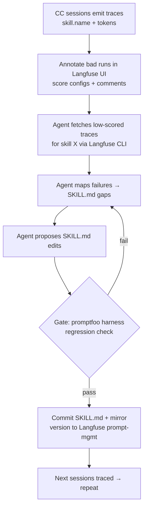

# Spike: Closing the loop — Langfuse traces + Langfuse Agent Skill to continuously improve skills

**Date:** 2026-06-30 · **Status:** Design · **Author:** André (+ Claude)
**Scope:** devflow + proof-of-skill skills. How we turn the now-live Langfuse trace data into a repeatable "next version of a skill is better than the last" loop.

---

## 0. TL;DR

Passive tracing is live (Claude Code → OTel collector → Langfuse v3 → ClickHouse, with `skill.name` attribution + token usage). We now have the **observe** half. This spike designs the **improve** half: a read/analyze/edit/gate loop built on the **Langfuse Agent Skill + CLI** (read/manage path) layered on top of our **OTel collector** (write/ingest path). The two do not conflict or duplicate — they're opposite halves of the same system.

Build order: **(a) `/devflow:trace-review`** → **(b) auto-mirror skills to Langfuse prompt-management** → **(c) trace-derived datasets + eval gate** → **(d) score-drop automations**.

---

## 1. Current state (given — built this session)

| Piece | State | Where |
|---|---|---|
| Langfuse v3.200.0 self-host | ✅ running, isolated compose project `devflow-langfuse` | http://localhost:3100, `docker/docker-compose.yml` |
| Passive CC tracing | ✅ live (terminal + desktop app) | `~/.claude/settings.json` env → OTel |
| OTel collector | ✅ :4318, Basic-auth + token-attr transform | `docker/otel-collector-config.yaml` |
| Token usage in traces | ✅ fixed (gen_ai.usage.* mapping) | collector transform |
| promptfoo eval harness | ✅ deterministic + llm-judge + version compare | `eval/` |
| determinize-skill + lib | ✅ audit + abstain-contract fixes | proof-of-skill |

**Read path missing:** an agent way to *query/analyze* those traces + *manage* prompts/datasets/evals. That's what this spike adds.

---

## 2. THE load-bearing architectural truth

Claude Code **skills are markdown files loaded from disk by the harness** — they are NOT fetched from Langfuse at runtime. This differs fundamentally from the Langfuse blog example, where the app calls `langfuse.get_prompt("name", label="production")` at runtime so Langfuse IS the source of truth.

**Consequence:** for our skills, Langfuse prompt-management is a **versioned MIRROR** — diff/history/trace-linking surface — **not** the runtime source. The git repo (`SKILL.md`) stays the source of truth. Everything below respects this: we never make a skill's behavior depend on a Langfuse fetch.

---

## 3. The improvement loop (adapted to file-based skills)

Based on the Langfuse pattern in [Using Agent Skills to Improve your Prompts](https://langfuse.com/blog/2026-02-16-prompt-improvement-claude-skills), adapted so the artifact updated is a `SKILL.md` in the repo (not a Langfuse-hosted prompt), and the regression gate is our promptfoo harness.

Loop steps, concretely:
1. **Annotate** — in the Langfuse UI, create score configs for recurring failure classes (e.g. `wrong-output-format`, `missed-determinism`, `hallucinated-step`); score + comment the bad skill-runs.
2. **Fetch + analyze** — agent (with the Langfuse skill) runs the CLI: "retrieve scores created this week for skill `determinize-skill`, with comments + linked trace content; map each to a gap in `skills/determinize-skill/SKILL.md`."
3. **Propose** — agent drafts SKILL.md edits addressing the gaps.
4. **Gate** — run `cd eval && npx -y promptfoo@latest eval -c skills/<skill>/determinism.promptfooconfig.yaml`; the edit must not regress existing asserts.
5. **Commit + mirror** — commit the SKILL.md; push the new version to Langfuse prompt-management (component b) for visual diff/history.

---

## 4. The Langfuse Agent Skill + CLI (the enabler)

- **What:** an Agent-Skills-standard skill ([github.com/langfuse/skills](https://github.com/langfuse/skills)) that conditions the agent on Langfuse best practices and drives the **Langfuse CLI** under the hood to query traces/scores, manage datasets, and manage prompts.
- **Install:** `npx skills add langfuse/skills --skill "langfuse"` (or symlink the repo's `skills/langfuse` into `~/.claude/skills/langfuse`). Progressive-disclosure: frontmatter always loaded, reference docs on demand.
- **Role:** the **READ/manage** path. Examples it enables: *"show me the last 10 traces with score < 0.5"*, *"create a dataset 'edge-cases' from these traces"*, *"fetch the prompt linked to these traces"*.
- **Auth:** CLI needs `LANGFUSE_HOST=http://localhost:3100` + `LANGFUSE_PUBLIC_KEY`/`LANGFUSE_SECRET_KEY` (already in `~/.config/zsh/secrets`).

---

## 5. Components to build (priority order)

### (a) `/devflow:trace-review` — weekly per-skill trace diff  ·  effort: M
A command (and optional scheduled routine) that, per skill, compares **this week vs last week**:
- error rate, p50/p95 latency, token cost, and score trend (from annotations/evals)
- flags regressions (e.g. error rate up >X%, score down, cost up >Y%)
- output: a markdown report grouped by skill, severity-tagged, with links back to exemplar traces.
- Data source: Langfuse CLI / API (`/api/public/traces`, `/api/public/observations`, `/api/public/scores`) filtered by `skill.name` + time window.
- Reuses devflow's report shape (cf. alert-report/daily-report agents).

### (b) Auto-mirror skills → Langfuse prompt-management  ·  effort: M
A git hook / CI step: on commit to a `SKILL.md`, push its content as a new version of a Langfuse prompt named `skill/<name>` (label `production`).
- Gives versioned history + diff in the Langfuse UI + a stable handle to link traces to a skill version.
- **Caveat (from §2):** mirror only. CC does not fetch from here at runtime. Document loudly so nobody assumes editing the Langfuse prompt changes skill behavior.
- Trace-linking: optionally stamp the skill version onto traces via a span attribute so the loop's "fetch the prompt linked to these traces" works.

### (c) Trace-derived datasets + eval regression gate  ·  effort: L
- Build Langfuse **datasets** from real failure traces (the annotated ones).
- Run them through promptfoo (primary) and/or Langfuse evaluators; wire as a regression gate before a skill edit lands.
- This is the langfuse blog's named "next step" — structured eval so prompt changes don't regress earlier cases.

### (d) Langfuse automations / webhooks — score-drop alerts  ·  effort: S
- Use the Langfuse **automations** page to trigger a webhook when a skill's score drops below threshold (→ Slack/notification).
- Lowest priority; alerting layer on top of (a)-(c).

---

## 6. DEDICATED: do our hooks/collector/telemetry conflict or duplicate with the Langfuse Agent Skill?

**Verdict: No conflict, no double-ingest. They are opposite halves.**

| Path | Mechanism | Direction |
|---|---|---|
| **Write/ingest** (ours) | CC OTel → settings.json env → collector :4318 → Langfuse `/api/public/otel` → ClickHouse | data INTO Langfuse |
| **Read/manage** (agent skill) | Langfuse Agent Skill → Langfuse CLI → `/api/public/*` REST | data OUT of / managed IN Langfuse |

- The Langfuse Agent Skill **does not install a tracer/exporter** — it's a CLI client over the public REST API. So it cannot double-emit traces. No second ingestion pipeline.
- devflow's own hooks (`prompt-fetch-rebase`, `post-pr-continue`, etc.) are unrelated to telemetry — they don't touch OTLP. No interaction.
- **One real noise risk:** if you run the Langfuse skill *inside* a traced Claude Code session, that session's own tool calls (incl. the Langfuse CLI calls) get traced too → meta-noise in the data. **Mitigation:** filter by `service.name` / `skill.name` in `/devflow:trace-review` and dataset queries; optionally tag analysis sessions to exclude them. Document the convention.
- **Token-attr transform (collector):** only renames attributes on ingest; the read path is unaffected.

**Net:** install + use the agent skill freely; it composes with, doesn't duplicate, the collector.

---

## 7. Open questions
1. **Cost = 0:** tokens now populate, but Langfuse lacks price definitions for new model IDs (`claude-opus-4-8[1m]`, `claude-sonnet-4-6`). Add custom model-price entries (Langfuse models API) — needs current per-token rates. Worth it for cost dashboards?
2. **Score source:** manual annotation (blog pattern) vs automated Langfuse evaluators vs promptfoo-as-scorer — which feeds `/devflow:trace-review`'s score trend? (Likely all three over time; start manual.)
3. **Trace→skill-version linking:** is a span attribute enough, or do we need the mirror (b) live first?
4. **Routine cadence:** weekly `/devflow:trace-review` as a scheduled task vs on-demand?
5. **Retention:** ClickHouse local disk growth — set a retention policy?

## 8. Phased rollout
- **Phase 0 (now):** install Langfuse Agent Skill; manually exercise the loop on ONE skill (e.g. determinize-skill) to validate end-to-end before automating.
- **Phase 1:** build `/devflow:trace-review` (a). Run it weekly by hand.
- **Phase 2:** auto-mirror (b) + trace→version linking.
- **Phase 3:** datasets + eval gate (c).
- **Phase 4:** automations/alerts (d) + cost (model pricing).

## 9. Success criteria
- An agent can, from one prompt, fetch a skill's low-scored traces + propose a SKILL.md edit gated by promptfoo. (loop works)
- `/devflow:trace-review` surfaces a real week-over-week regression on a real skill.
- Every skill edit is regression-gated (no silent quality drop).
- Zero duplicate ingestion; trace data filterable by skill.

## 10. Risks
- **File-based caveat ignored** → someone edits a Langfuse prompt expecting skill behavior to change. Mitigate: loud docs + naming (`skill/<name>` + "mirror" label).
- **Annotation effort** → the loop needs human scoring to start; if nobody annotates, no signal. Mitigate: seed with promptfoo failures as auto-scores.
- **Langfuse self-host fragility** (seen this session: boot ordering, project collisions). Mitigate: the isolated `devflow-langfuse` project + documented gotchas in `eval/OBSERVABILITY.md`.
