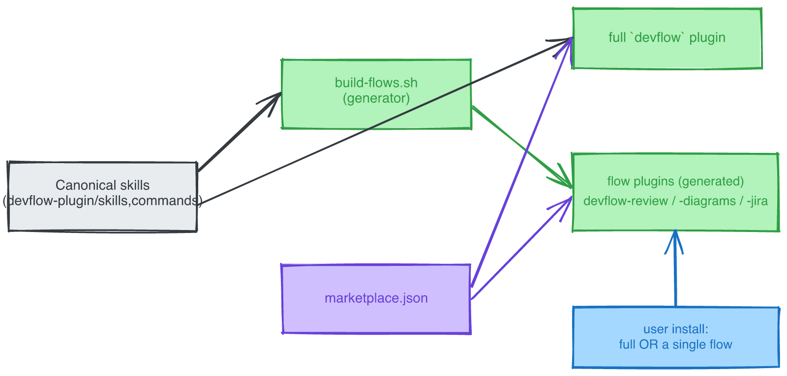

# Feature: Flow-separated marketplace + per-skill optional-deps

> Formalizes the approved design at `docs/plans/2026-06-12-flow-marketplace-and-optional-deps-design.md`. That doc is authoritative for rationale + rejected alternatives; this spec is the build contract (architecture impact, acceptance criteria, ordered tasks, edge cases, testing).

## Problem Statement

devflow ships as one monolithic plugin (`devflow`, source `./` = `devflow-plugin/`). Installing it pulls the entire pipeline (worktrees, phase-handoff, memory, observability) even when a user only wants code review. There is no way to install a single flow standalone, no structured record of what each skill depends on, and no graceful handling when an OPTIONAL dependency (notably Hindsight) is absent. Three adjacent gaps: `write-spike` lives in the wrong repo (`proof-of-skill`, symlinked); `devflow visualizations render` silently assumes its npm deps are pre-installed; and there is no in-product rule telling the agent when a diagram is complex enough to warrant a rendered Excalidraw.

## Proposed Solution

Five intertwined scopes, built B→C→A→D→E, shipped as one MR (merge ⇒ release):

- **A** — add small flow plugins (`devflow-review`, `devflow-diagrams`, `devflow-jira`) alongside the unchanged full `devflow` plugin in the existing marketplace. Each flow is a generated, self-contained mini-plugin so a single-flow install never drags in the pipeline.
- **B** — each skill declares REQUIRED + OPTIONAL deps in a sibling `requirements.json`; a prompt-driven `## Preflight` block enforces it (required missing ⇒ stop; optional missing ⇒ ask). Hindsight is OPTIONAL everywhere.
- **C** — move `write-spike` into devflow as a real skill (canonical home), config split, real Aircall config YADM-tracked outside the repo.
- **D** — `devflow visualizations render` self-provisions its npm deps (local cache + consent), works with zero `devflow init`; the diagrams flow bundles the renderer so it works without `bin/devflow`.
- **E** — a 🟢🟡🔴 diagram-complexity rule shipped via `templates/CLAUDE.md.tmpl` (→ global `~/.claude/CLAUDE.md` on init) + embedded atop the diagram-producing skills.

## Architecture Impact

devflow is a bash CLI + a Claude Code plugin (not a layered app). Mapping the change to its real structure:

- **CLI / lib layer** (`bin/devflow`, `lib/`): new `deps` + `flows` subcommands (case arms + help); new `lib/render-deps.sh` (shared dep resolver); `lib/release.sh` `bump_all_versions` extended to stamp flow `plugin.json` + flow command badges; new `lib/deps.sh` (or fold into existing) for `devflow deps check`.
- **Plugin / skills layer** (`devflow-plugin/`, `skills/`): per-skill `requirements.json` + `## Preflight` blocks; `write-spike` added as a 3-copy skill; `render-diagram` render step made CLI-optional; rule embedded atop diagram-producing skills.
- **Distribution layer** (`devflow-plugin/.claude-plugin/marketplace.json`, new `flows/`): 3 new plugin entries; generated `flows/<flow>/` mini-plugins; `scripts/build-flows.sh`; `Makefile` `flows` + `flows-check` targets.
- **Init / templates layer** (`lib/init.sh`, `templates/`): rule added to `templates/CLAUDE.md.tmpl` (flows to global `~/.claude/CLAUDE.md` via existing init step 3); `lib/init.sh` docs mention flow plugins (no behavior change — full `devflow` stays the default install).

*Canonical skills feed both the full `devflow` plugin and (via `build-flows.sh`) the generated flow plugins; `marketplace.json` lists all four; a user installs the full plugin OR a single flow.*

## Technical Design

### A — flow plugins (generated)
`marketplace.json` gains entries: `devflow-review` (source `./flows/review/`, skills review + review-document + write-spike), `devflow-diagrams` (`./flows/diagrams/`, render-diagram), `devflow-jira` (`./flows/jira/`, best-roi-task). Each `flows/<flow>/` is a self-contained mini-plugin: own `.claude-plugin/plugin.json`, `commands/`, `skills/<skill>/SKILL.md` + `requirements.json` + bundle files — all **generated** from canonical `devflow-plugin/{commands,skills}` by `scripts/build-flows.sh`. A `flows.manifest` (flow→skills map) is the single edit point. `make flows` regenerates; `make flows-check` regenerates to a temp dir and `git diff --exit-code`s committed `flows/` (drift guard, wired into `make test` + finish-feature sensitive gate).

### B — requirements.json + preflight
Sibling `skills/<skill>/requirements.json`: `{ skill, required[], optional[] }`. Each dep: `name`, `check` (shell command, exit 0 ⇒ present; OR a named probe for non-command deps e.g. `hindsight`), `why`, `install`; optional deps add `degrade`. A `## Preflight` block in each SKILL.md: read the sibling file → required missing ⇒ STOP + report install hint; optional missing ⇒ `AskUserQuestion` {provide alternative / continue without (degrade) / abort}. Optional accelerator: `devflow deps check <skill>` (deterministic table) when `devflow` is on PATH; never required. Compact `requires`/`optional` name-lists mirrored into `skills/registry.json`.

### C — write-spike move
Bring real files from `~/.local/share/proof-of-skill/skills/write-spike/` into the 3-copy structure + register (`plugin.json` skills[], `registry.json`, category code-review) + flow copy in `devflow-review`. Remove the `~/.claude/skills/write-spike` symlink. Config: commit `company-config.example.yaml` (placeholders); skill reads real config from `~/.config/devflow/write-spike/company-config.yaml` (fallback to example); real Aircall config placed there + YADM-tracked.

### D — self-contained render
`lib/render-deps.sh` resolves `canvas` + `excalidraw-to-svg` + `@resvg/resvg-js`: existing globals → else `~/.devflow/render-deps/node_modules` → else `AskUserQuestion` consent + `npm i --prefix ~/.devflow/render-deps <pkgs>` (no `-g`, no sudo, `canvas@3+` pin). Exports `NODE_PATH` + `EXCAL_NODE_MODULES`. `viz_render` calls it instead of dying. The `devflow-diagrams` flow bundles `excalidraw-export.cjs` + `render-deps.sh` + a launcher; render-diagram uses `devflow visualizations render` if on PATH, else `node "$SKILL_DIR/excalidraw-export.cjs"` with bundled resolution. `node`/`npm` REQUIRED in render-diagram's `requirements.json`.

### E — diagram-complexity rule
Rule text added to `templates/CLAUDE.md.tmpl` (inside the `<!-- devflow -->` block so `devflow init` step 3 carries it into `~/.claude/CLAUDE.md`) + embedded atop render-diagram, spec-feature, codebase-walkthrough, update-visualizations, architecture-decision. No hook (keyword detection fuzzy + fires at wrong moment).

## Constraints & Decisions

- **Merge ⇒ release**; never write the literal skip-release marker in commit prose (`lib/release.sh` now only honors it in subject/trailer, but stay clear).
- **3-copy skill rule** stays; flows add a *generated* 4th copy — never hand-edit `flows/`.
- **No cross-repo deps**; **Hindsight OPTIONAL** on every skill (single-skill install must run without it).
- **bash 3.2 safety** (macOS): empty-array idiom `${arr[@]+"${arr[@]}"}`, no `grep -c` inside `$(...)` under pipefail, test with `/bin/bash`.
- **YADM never tracks under `~/dev`** — real write-spike config lives at `~/.config/devflow/...`, not in the repo.
- **`detect_vcs_provider` / pipefail** guard pattern: assignment-then-fallback.
- Per-flow `plugin.json` requirement + full-plugin non-recursion of `flows/` must be VERIFIED on one flow before generating all.

## Acceptance Criteria

- [ ] AC1: `claude plugin install devflow-review@devflow-marketplace` installs ONLY review + review-document + write-spike (no pipeline/worktree/memory skills present).
- [ ] AC2: full `devflow` plugin install is unchanged (all skills present, no flow skills double-listed).
- [ ] AC3: every in-scope skill has a `requirements.json` + a `## Preflight` block; a skill whose REQUIRED dep is absent stops with the install hint; whose OPTIONAL dep is absent prompts via `AskUserQuestion`.
- [ ] AC4: a skill runs to completion with Hindsight unavailable (degrades to no recall/retain) without manual intervention beyond the one optional-dep prompt.
- [ ] AC5: `/devflow:write-spike` resolves (skill exists in devflow); the `~/.claude/skills/write-spike` symlink is gone; `company-config.example.yaml` is committed and the real config path is `~/.config/devflow/write-spike/company-config.yaml`.
- [ ] AC6: `devflow visualizations render <f>.excalidraw` renders a PNG on a machine with NONE of the 3 deps pre-installed, after a single consent prompt, without `devflow init` and without `-g`/sudo.
- [ ] AC7: render-diagram renders when only the `devflow-diagrams` flow is installed (no `bin/devflow` on PATH).
- [ ] AC8: after `devflow init`, `~/.claude/CLAUDE.md` contains the 🟢🟡🔴 rule; render-diagram + the 4 diagram-producing skills embed it.
- [ ] AC9: `make flows` is idempotent; editing a canonical skill without re-running it makes `make flows-check` (and `make test`) fail.
- [ ] AC10: a release bump stamps the new version into every flow `plugin.json` + flow command badge (no version drift between full and flow plugins).

## Non-goals

Explicitly out of scope:
- Cross-ecosystem (Codex / OpenCode) compat — separate later effort (scope F).
- Re-architecting the existing 3-copy convention or the existing full plugin.
- A diagram-detection hook.
- Auto-installing flow plugins during `devflow init` (full `devflow` stays the default; flows are user-driven installs).
- Removing the stale `write-spike` source from the `proof-of-skill` repo (follow-up in that repo).

## Edge Cases

- npm cache dir (`~/.devflow/render-deps`) partially populated / corrupt → resolver re-checks each package, reinstalls missing only.
- `excalidraw-to-svg` CWD-relative `@excalidraw/utils` load with `--prefix` cache → `EXCAL_NODE_MODULES` must point at the cache's `node_modules`.
- node < 25 vs ≥ 25 → `canvas@3+` pin (canvas@2 has no node-25 prebuilt).
- Optional-dep prompt under non-interactive run (`claude --print`, cron) → default to "continue without (degrade)"; never hang.
- Flow generator run when a skill referenced in `flows.manifest` doesn't exist → fail with a clear error, don't emit a half-tree.
- `requirements.json` missing for a skill → preflight treats as "no declared deps" (no-op), does not error.
- Re-running `devflow init` when the rule block already exists → idempotent (existing `<!-- devflow -->` marker guard).
- write-spike with neither real config nor example present → skill errors with the expected config path.

## Testing Strategy

- **Bats unit**: `build-flows` emits the expected tree for a fixture map; `flows-check` detects an injected drift; `render-deps` resolution order (globals → cache → consent-install, mocked `npm`); `bump_all_versions` stamps flow `plugin.json` + badges; preflight parse of a fixture `requirements.json` with a missing optional dep.
- **bash 3.2**: run new scripts under `/bin/bash`; subagent spec-review pass for empty-array / pipefail gotchas.
- **Manual**: install `devflow-review` alone in a throwaway project → assert skill set + review runs; render a 🔴 diagram with only `devflow-diagrams` installed; render on a deps-cleared environment (consent path).
- **Drift**: `make test` includes `flows-check`.

## Implementation Plan (ordered tasks)

**Phase B — requirements + preflight**
1. Define `requirements.json` schema + write per-skill files for review, review-document, best-roi-task, render-diagram (+ write-spike in C). Hindsight optional everywhere.
2. Add a reusable `## Preflight` block to each in-scope SKILL.md (3-copy).
3. Add `devflow deps check <skill>` (`lib/deps.sh` + `bin/devflow` arm + help) — deterministic table, optional accelerator.
4. Mirror compact `requires`/`optional` lists into `skills/registry.json`. Bats tests for preflight parse + `deps check`.

**Phase C — move write-spike in**
5. Copy real files into the 3-copy structure; add frontmatter + version badge to the command; `requirements.json` (Hindsight optional); register in `plugin.json` + `registry.json`.
6. Split config: commit `company-config.example.yaml`; skill resolves `~/.config/devflow/write-spike/company-config.yaml` w/ example fallback; place real Aircall config there + `yadm add`.
7. Remove `~/.claude/skills/write-spike` symlink. Verify `/devflow:write-spike` resolves + review-document reference.

**Phase A — flow plugins**
8. Write `flows.manifest` + `scripts/build-flows.sh` (generate `flows/<flow>/` mini-plugins incl. `.claude-plugin/plugin.json`, commands, skills, requirements.json, bundle files). VERIFY per-flow plugin.json requirement + full-plugin non-recursion on ONE flow first.
9. Add `make flows` + `make flows-check`; wire `flows-check` into `make test` + finish-feature sensitive gate; `devflow flows` subcommand (+ help).
10. Add the 3 flow plugin entries to `marketplace.json`; extend `lib/release.sh bump_all_versions` to stamp flow `plugin.json` + flow command badges. Bats for build/check/version-stamp.

**Phase D — self-contained render**
11. `lib/render-deps.sh` (resolve globals → cache → consent-install, pinned); refactor `viz_render` to use it.
12. Bundle `excalidraw-export.cjs` + `render-deps.sh` + launcher into the `devflow-diagrams` flow; make render-diagram render CLI-optional; `node`/`npm` REQUIRED in its requirements.json. Bats for resolver.

**Phase E — complexity rule**
13. Add the 🟢🟡🔴 rule to `templates/CLAUDE.md.tmpl` (inside `<!-- devflow -->` block); confirm init idempotency.
14. Embed the rule atop render-diagram, spec-feature, codebase-walkthrough, update-visualizations, architecture-decision (3-copy each).

**Finish**
15. Regenerate flows (`make flows`), run `make test` + `make test-unit`, version-bump dry check, then `/devflow:finish-feature` → one MR (merge ⇒ release).
