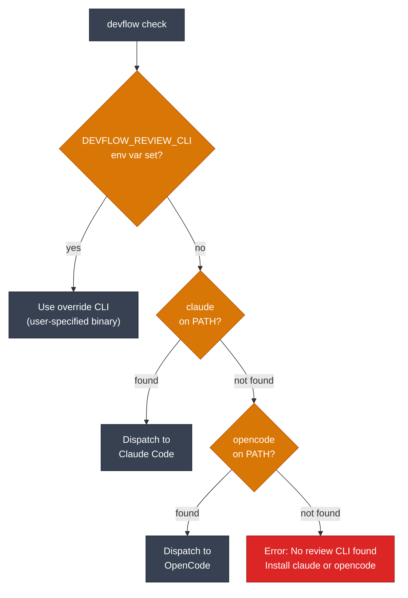
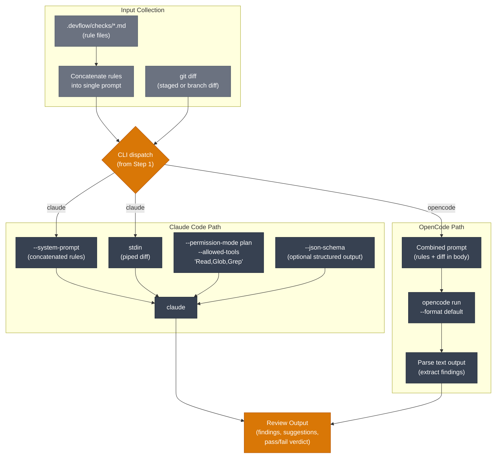
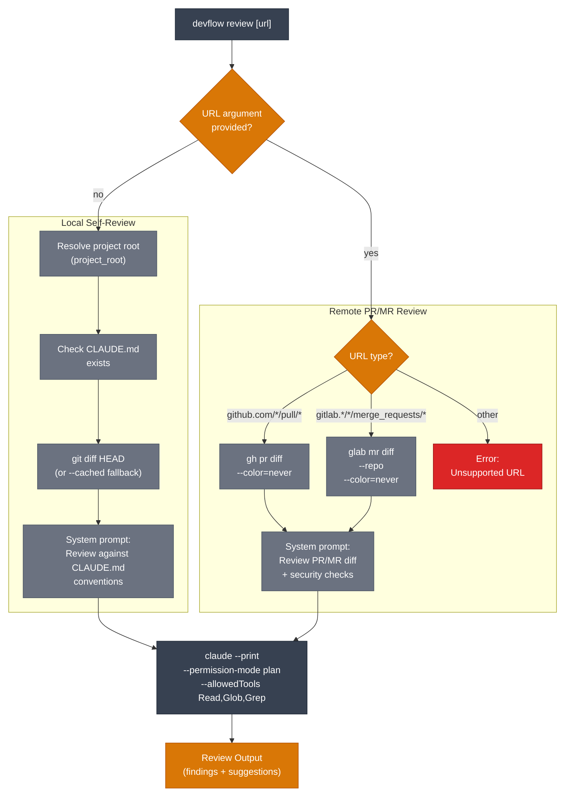
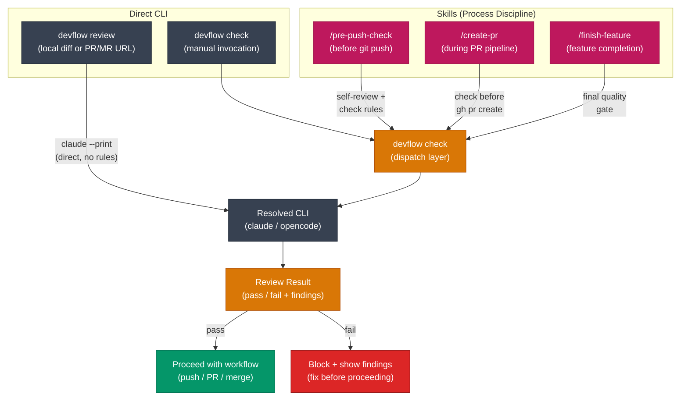

# Code Review Architecture — Multi-CLI Abstraction

> Layer 4 of the devflow stack — AI-powered code review using Claude Code (primary) or OpenCode (fallback).
> Replaces the Continue.dev (`cn check`) dependency with a portable multi-CLI dispatch layer.

---

## 1. CLI Dispatch Flow

How `devflow check` resolves which AI CLI to invoke:

---

## 2. Check Rules Pipeline

Data flow from check rule files through each CLI backend to structured output:

---

## 3. devflow review — Dual-Mode Flow

`devflow review` supports two modes: local self-review (no args) and remote PR/MR review (URL argument).

---

## 4. Integration Points

Skills and commands that trigger `devflow check` as part of their workflow:

---

## Notes

- **Why multi-CLI?** Continue.dev (`cn check`) was a single point of failure and required a separate npm dependency. The new dispatch layer uses whichever AI CLI is already installed.
- **Rule files** live in `.devflow/checks/*.md` (migrated from `.continue/checks/*.md`). Each file is a self-contained review rule with criteria and examples.
- **Structured output** via `--json-schema` is optional — when provided, Claude Code returns machine-parseable results for CI integration.
- **Fallback order** is deterministic: env override > claude > opencode. No interactive prompts during dispatch.
- **`devflow review`** is distinct from `devflow check` — it's a lighter-weight review that doesn't use `.devflow/checks/` rules. It supports two modes: local diff (against CLAUDE.md conventions) and remote PR/MR review by URL (GitHub `gh` or GitLab `glab`).
