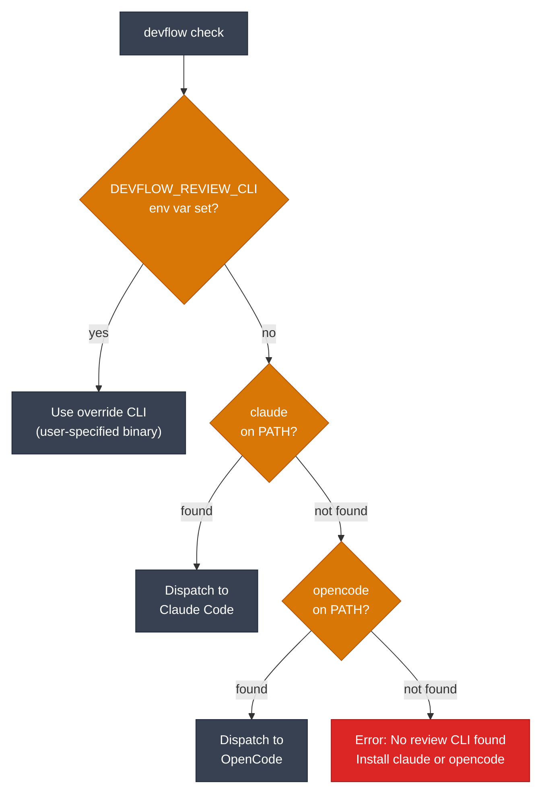
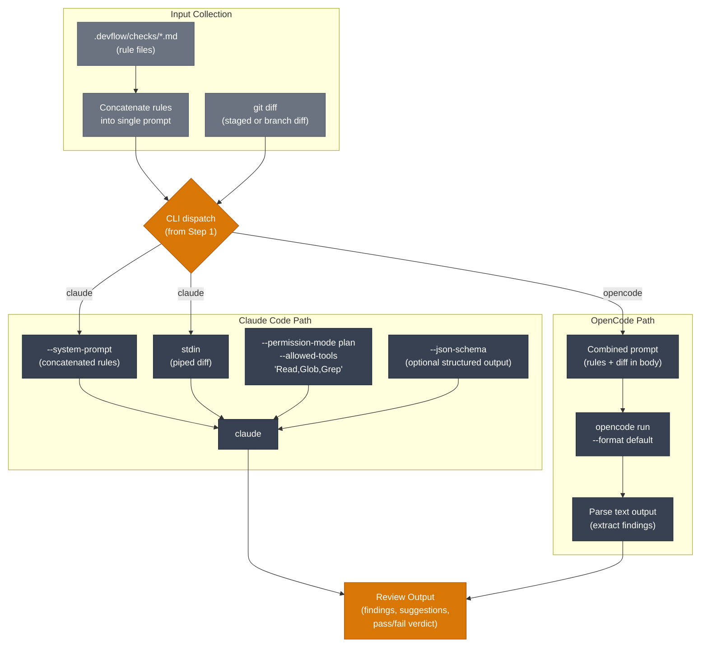
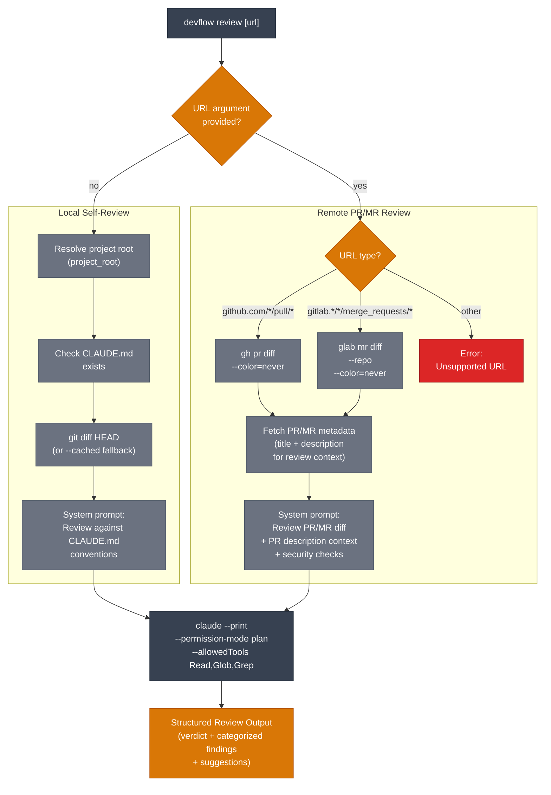
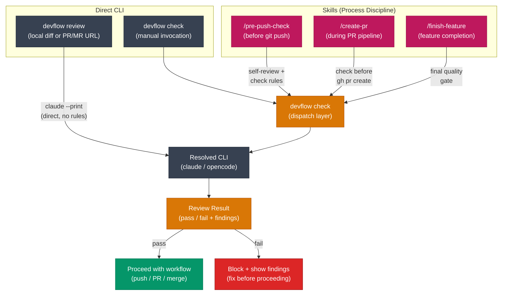
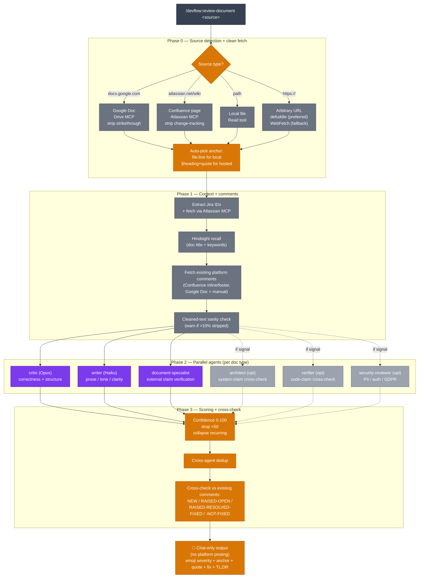

# Code Review Architecture — Multi-CLI Abstraction

> Layer 4 of the devflow stack — AI-powered code review using Claude Code (primary) or OpenCode (fallback).
> Replaces the Continue.dev (`cn check`) dependency with a portable multi-CLI dispatch layer.

---

## 1. CLI Dispatch Flow

How `devflow check` resolves which AI CLI to invoke:

```mermaid
%%{init: {'flowchart': {'rankSpacing': 50, 'nodeSpacing': 30, 'diagramPadding': 15}}}%%
flowchart TD
    START["devflow check"]
    ENV{"DEVFLOW_REVIEW_CLI\nenv var set?"}
    USE_OVERRIDE["Use override CLI\n(user-specified binary)"]
    DETECT_CLAUDE{"claude\non PATH?"}
    USE_CLAUDE["Dispatch to\nClaude Code"]
    DETECT_OC{"opencode\non PATH?"}
    USE_OC["Dispatch to\nOpenCode"]
    FAIL["Error: No review CLI found\nInstall claude or opencode"]

    START --> ENV
    ENV -->|"yes"| USE_OVERRIDE
    ENV -->|"no"| DETECT_CLAUDE
    DETECT_CLAUDE -->|"found"| USE_CLAUDE
    DETECT_CLAUDE -->|"not found"| DETECT_OC
    DETECT_OC -->|"found"| USE_OC
    DETECT_OC -->|"not found"| FAIL

    classDef reviewStyle fill:#d97706,color:#fff,stroke:#b45309
    classDef cliStyle fill:#374151,color:#fff,stroke:#1f2937
    classDef errorStyle fill:#dc2626,color:#fff,stroke:#991b1b

    class START cliStyle
    class ENV,DETECT_CLAUDE,DETECT_OC reviewStyle
    class USE_OVERRIDE,USE_CLAUDE,USE_OC cliStyle
    class FAIL errorStyle
```

---

## 2. Check Rules Pipeline

Data flow from check rule files through each CLI backend to structured output:

```mermaid
%%{init: {'flowchart': {'rankSpacing': 50, 'nodeSpacing': 30, 'diagramPadding': 15}}}%%
flowchart TD
    subgraph Input [" Input Collection "]
        RULES[".devflow/checks/*.md\n(rule files)"]
        DIFF["git diff\n(staged or branch diff)"]
        RULES --> CONCAT["Concatenate rules\ninto single prompt"]
    end

    CONCAT --> DISPATCH{"CLI dispatch\n(from Step 1)"}
    DIFF --> DISPATCH

    subgraph Claude [" Claude Code Path "]
        CC_SYS["--system-prompt\n(concatenated rules)"]
        CC_STDIN["stdin\n(piped diff)"]
        CC_FLAGS["--permission-mode plan\n--allowed-tools\n'Read,Glob,Grep'"]
        CC_SCHEMA["--json-schema\n(optional structured output)"]
        CC_EXEC["claude"]
        CC_SYS --> CC_EXEC
        CC_STDIN --> CC_EXEC
        CC_FLAGS --> CC_EXEC
        CC_SCHEMA --> CC_EXEC
    end

    subgraph OpenCode [" OpenCode Path "]
        OC_PROMPT["Combined prompt\n(rules + diff in body)"]
        OC_FLAGS["opencode run\n--format default"]
        OC_PARSE["Parse text output\n(extract findings)"]
        OC_PROMPT --> OC_FLAGS
        OC_FLAGS --> OC_PARSE
    end

    DISPATCH -->|"claude"| CC_SYS
    DISPATCH -->|"claude"| CC_STDIN
    DISPATCH -->|"opencode"| OC_PROMPT

    CC_EXEC --> OUTPUT["Review Output\n(findings, suggestions,\npass/fail verdict)"]
    OC_PARSE --> OUTPUT

    classDef reviewStyle fill:#d97706,color:#fff,stroke:#b45309
    classDef cliStyle fill:#374151,color:#fff,stroke:#1f2937
    classDef inputStyle fill:#6b7280,color:#fff,stroke:#4b5563

    class RULES,DIFF,CONCAT inputStyle
    class DISPATCH reviewStyle
    class CC_SYS,CC_STDIN,CC_FLAGS,CC_SCHEMA,CC_EXEC cliStyle
    class OC_PROMPT,OC_FLAGS,OC_PARSE cliStyle
    class OUTPUT reviewStyle
```

---

## 3. devflow review — Dual-Mode Flow

`devflow review` supports two modes: local self-review (no args) and remote PR/MR review (URL argument).

```mermaid
%%{init: {'flowchart': {'rankSpacing': 50, 'nodeSpacing': 30, 'diagramPadding': 15}}}%%
flowchart TD
    START["devflow review [url]"]
    HAS_URL{"URL argument\nprovided?"}

    subgraph LocalMode [" Local Self-Review "]
        L_PROJ["Resolve project root\n(project_root)"]
        L_CLAUDE["Check CLAUDE.md\nexists"]
        L_DIFF["git diff HEAD\n(or --cached fallback)"]
        L_PROMPT["System prompt:\nReview against CLAUDE.md\nconventions"]
        L_PROJ --> L_CLAUDE --> L_DIFF --> L_PROMPT
    end

    subgraph RemoteMode [" Remote PR/MR Review "]
        R_DETECT{"URL type?"}
        R_GH["gh pr diff <url>\n--color=never"]
        R_GL["glab mr diff <number>\n--repo <project-path>\n--color=never"]
        R_FAIL["Error:\nUnsupported URL"]
        R_INFO["Fetch PR/MR metadata<br/>(title + description<br/>for review context)"]
        R_PROMPT["System prompt:\nReview PR/MR diff\n+ PR description context\n+ security checks"]
        R_DETECT -->|"github.com/*/pull/*"| R_GH
        R_DETECT -->|"gitlab.*/*/merge_requests/*"| R_GL
        R_DETECT -->|"other"| R_FAIL
        R_GH --> R_INFO
        R_GL --> R_INFO
        R_INFO --> R_PROMPT
    end

    START --> HAS_URL
    HAS_URL -->|"no"| L_PROJ
    HAS_URL -->|"yes"| R_DETECT

    L_PROMPT --> CLAUDE_EXEC
    R_PROMPT --> CLAUDE_EXEC

    CLAUDE_EXEC["claude --print\n--permission-mode plan\n--allowedTools Read,Glob,Grep"]
    CLAUDE_EXEC --> OUTPUT["Structured Review Output\n(verdict + categorized findings\n+ suggestions)"]

    classDef reviewStyle fill:#d97706,color:#fff,stroke:#b45309
    classDef cliStyle fill:#374151,color:#fff,stroke:#1f2937
    classDef errorStyle fill:#dc2626,color:#fff,stroke:#991b1b
    classDef inputStyle fill:#6b7280,color:#fff,stroke:#4b5563

    class START cliStyle
    class HAS_URL,R_DETECT reviewStyle
    class L_PROJ,L_CLAUDE,L_DIFF,L_PROMPT inputStyle
    class R_GH,R_GL,R_INFO,R_PROMPT inputStyle
    class CLAUDE_EXEC cliStyle
    class OUTPUT reviewStyle
    class R_FAIL errorStyle
```

---

## 4. Integration Points

Skills and commands that trigger `devflow check` as part of their workflow:

```mermaid
%%{init: {'flowchart': {'rankSpacing': 50, 'nodeSpacing': 30, 'diagramPadding': 15}}}%%
flowchart TD
    subgraph DirectInvocation [" Direct CLI "]
        DIRECT["devflow check\n(manual invocation)"]
        REVIEW["devflow review\n(local diff or PR/MR URL)"]
    end

    subgraph Skills [" Skills (Process Discipline) "]
        PREPUSH["/pre-push-check\n(before git push)"]
        CREATEPR["/create-pr\n(during PR pipeline)"]
        FINISH["/finish-feature\n(feature completion)"]
    end

    CHECK["devflow check\n(dispatch layer)"]
    CLI["Resolved CLI\n(claude / opencode)"]
    RESULT["Review Result\n(pass / fail + findings)"]

    DIRECT --> CHECK
    REVIEW -->|"claude --print\n(direct, no rules)"| CLI
    PREPUSH -->|"self-review +\ncheck rules"| CHECK
    CREATEPR -->|"check before\ngh pr create"| CHECK
    FINISH -->|"final quality\ngate"| CHECK

    CHECK --> CLI
    CLI --> RESULT

    RESULT -->|"pass"| PASS["Proceed with workflow\n(push / PR / merge)"]
    RESULT -->|"fail"| BLOCK["Block + show findings\n(fix before proceeding)"]

    classDef reviewStyle fill:#d97706,color:#fff,stroke:#b45309
    classDef skillsStyle fill:#be185d,color:#fff,stroke:#9d174d
    classDef cliStyle fill:#374151,color:#fff,stroke:#1f2937
    classDef passStyle fill:#059669,color:#fff,stroke:#047857
    classDef failStyle fill:#dc2626,color:#fff,stroke:#991b1b

    class DIRECT,REVIEW cliStyle
    class PREPUSH,CREATEPR,FINISH skillsStyle
    class CHECK,RESULT reviewStyle
    class CLI cliStyle
    class PASS passStyle
    class BLOCK failStyle
```

---

## 5. /devflow:review-document — Prose Doc Review

`/devflow:review-document` is the prose-doc counterpart to `devflow review`. Where `devflow review` reviews **code diffs**, `/devflow:review-document` reviews **prose docs** (KB articles, RFCs, spikes, runbooks, PRDs, design docs). Different inputs, different agent set, different output anchor model.

```mermaid
%%{init: {'flowchart': {'rankSpacing': 50, 'nodeSpacing': 30, 'diagramPadding': 15}}}%%
flowchart TD
    START["/devflow:review-document &lt;source&gt;"]

    subgraph P0 [" Phase 0 — Source detection + clean fetch "]
        DETECT{"Source type?"}
        GD["Google Doc<br/>Drive MCP<br/>strip strikethrough"]
        CF["Confluence page<br/>Atlassian MCP<br/>strip change-tracking"]
        LF["Local file<br/>Read tool"]
        URL["Arbitrary URL<br/>defuddle (preferred)<br/>WebFetch (fallback)"]
        ANCHOR["Auto-pick anchor:<br/>file:line for local<br/>§heading+quote for hosted"]
        DETECT -->|"docs.google.com"| GD
        DETECT -->|"atlassian.net/wiki"| CF
        DETECT -->|"path"| LF
        DETECT -->|"https://"| URL
        GD --> ANCHOR
        CF --> ANCHOR
        LF --> ANCHOR
        URL --> ANCHOR
    end

    subgraph P1 [" Phase 1 — Context + comments "]
        TICKETS["Extract Jira IDs<br/>+ fetch via Atlassian MCP"]
        MEM["Hindsight recall<br/>(doc title + keywords)"]
        COMMENTS["Fetch existing platform comments<br/>(Confluence inline/footer,<br/>Google Doc = manual)"]
        SANITY["Cleaned-text sanity check<br/>(warn if &gt;10% stripped)"]
    end

    subgraph P2 [" Phase 2 — Parallel agents (per doc type) "]
        CRITIC["critic (Opus)<br/>correctness + structure"]
        WRITER["writer (Haiku)<br/>prose / tone / clarity"]
        DOCSPEC["document-specialist<br/>external claim verification"]
        ARCH["architect (opt)<br/>system-claim cross-check"]
        VER["verifier (opt)<br/>code-claim cross-check"]
        SEC["security-reviewer (opt)<br/>PII / auth / GDPR"]
    end

    subgraph P3 [" Phase 3 — Scoring + cross-check "]
        SCORE["Confidence 0-100<br/>drop &lt;50<br/>collapse recurring"]
        DEDUP["Cross-agent dedup"]
        XCHECK["Cross-check vs existing comments:<br/>NEW / RAISED-OPEN /<br/>RAISED-RESOLVED-FIXED / -NOT-FIXED"]
    end

    OUTPUT["🔵 Chat-only output<br/>(no platform posting)<br/>emoji severity + anchor + quote + fix + TL;DR"]

    START --> DETECT
    ANCHOR --> TICKETS
    TICKETS --> MEM --> COMMENTS --> SANITY
    SANITY --> CRITIC
    SANITY --> WRITER
    SANITY --> DOCSPEC
    SANITY -.->|"if signal"| ARCH
    SANITY -.->|"if signal"| VER
    SANITY -.->|"if signal"| SEC
    CRITIC --> SCORE
    WRITER --> SCORE
    DOCSPEC --> SCORE
    ARCH -.-> SCORE
    VER -.-> SCORE
    SEC -.-> SCORE
    SCORE --> DEDUP --> XCHECK --> OUTPUT

    classDef reviewStyle fill:#d97706,color:#fff,stroke:#b45309
    classDef cliStyle fill:#374151,color:#fff,stroke:#1f2937
    classDef inputStyle fill:#6b7280,color:#fff,stroke:#4b5563
    classDef agentStyle fill:#7c3aed,color:#fff,stroke:#5b21b6
    classDef condStyle fill:#9ca3af,color:#fff,stroke:#6b7280

    class START cliStyle
    class DETECT,ANCHOR reviewStyle
    class GD,CF,LF,URL inputStyle
    class TICKETS,MEM,COMMENTS,SANITY inputStyle
    class CRITIC,WRITER,DOCSPEC agentStyle
    class ARCH,VER,SEC condStyle
    class SCORE,DEDUP,XCHECK reviewStyle
    class OUTPUT reviewStyle
```

### Key differences vs `devflow review`

| Dimension | `devflow review` (code) | `/devflow:review-document` (prose) |
|---|---|---|
| Input | git diff or PR/MR URL | Google Doc / Confluence / local file / arbitrary URL |
| Fetch | `gh pr diff` / `glab mr diff` / `git diff` | Drive MCP / Atlassian MCP / Read / defuddle |
| Agent set | code-focused (bug scanner, convention, test coverage…) | prose-focused (critic, writer, document-specialist…) |
| Anchor | `file:line` always | auto-pick: `file:line` for local, `§heading+quote` for hosted |
| Existing comments cross-check | yes (GitHub reviews / GitLab discussions, paginated) | yes (Confluence footer + inline; Google Doc unsupported by Drive MCP — manual fallback) |
| Output | code-suggestion fences inline | prose rewrites verbatim |
| Inline comment posting | optional draft pending (GitHub PENDING / GitLab draft_notes) | chat-only, no platform posting in v1 |

### Soft dependency — defuddle

For arbitrary-URL inputs, the skill prefers the upstream **defuddle** CLI (`github.com/kepano/defuddle`, `npm install -g defuddle`) for clean rendered text. When defuddle is missing, it falls back to `WebFetch` and surfaces that downgrade in the output's Context section. defuddle is intentionally NOT vendored into devflow — it tracks upstream releases via `npm`.

---

## Notes

- **Why multi-CLI?** Continue.dev (`cn check`) was a single point of failure and required a separate npm dependency. The new dispatch layer uses whichever AI CLI is already installed.
- **Rule files** live in `.devflow/checks/*.md` (migrated from `.continue/checks/*.md`). Each file is a self-contained review rule with criteria and examples.
- **Structured output** via `--json-schema` is optional — when provided, Claude Code returns machine-parseable results for CI integration.
- **Fallback order** is deterministic: env override > claude > opencode. No interactive prompts during dispatch.
- **`devflow review`** is distinct from `devflow check` — it's a lighter-weight review that doesn't use `.devflow/checks/` rules. It supports two modes: local diff (against CLAUDE.md conventions) and remote PR/MR review by URL (GitHub `gh` or GitLab `glab`).
- **`/devflow:review-document`** is the sibling for prose docs (KB / RFC / spike / runbook / PRD / design). It uses different agents and a different anchor format because the inputs and audiences are different. See section 5 above.
