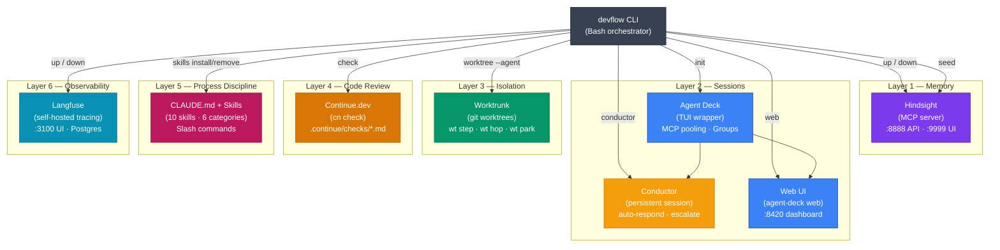
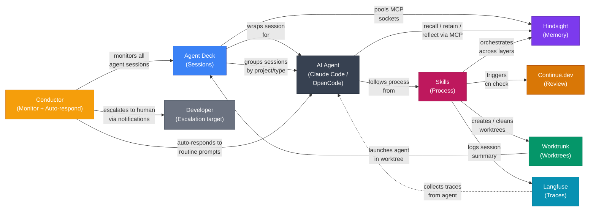

---
tags:
  [
    devflow,
    tooling,
    ai-development,
    hindsight,
    agent-deck,
    worktrunk,
    continue-dev,
    langfuse,
    skills,
    conductor,
  ]
related: ["[[development-workflow]]"]
---

# Devflow Ecosystem — The 6-Layer AI Dev Environment

> Local-first AI development orchestrator. Each layer is an independent tool; devflow composes them.
> Related: [[development-workflow]]

---

## 1. Layer Overview

---

## 2. Cross-Layer Connections

---

## 3. Skill-to-Layer Mapping

Each skill is a slash command that orchestrates across multiple layers:

| Skill                    | Layer | Touches | What it does                                       |
| ------------------------ | ----- | ------- | -------------------------------------------------- |
| `/memory-recall`         | 1     | L1      | Recall memories before starting a task             |
| `/retain-learning`       | 1     | L1      | Store a discovery into Hindsight                   |
| `/reflect-session`       | 1     | L1      | End-of-session reflection and memory consolidation |
| `/new-feature`           | 1     | L1      | POST-LAUNCH setup guide for new feature workspace  |
| `/finish-feature`        | 4     | L4 + L1 | cn check + retain learnings (terminal action)      |
| `/pre-push-check`        | 4     | L4 + L5 | cn check + CLAUDE.md compliance self-review        |
| `/create-pr`             | 4     | L4 + L1 | Self-review + cn check + gh pr create              |
| `/spec-feature`          | 5     | L1 + L5 | Architecture recall + spec doc + task breakdown    |
| `/architecture-decision` | 5     | L1 + L5 | ADR + Hindsight retention + CLAUDE.md update       |
| `/session-summary`       | 6     | L6 + L1 | Metrics, quality scores, Langfuse trace logging    |

---

## 4. Runtime Architecture

```mermaid
%%{init: {'flowchart': {'rankSpacing': 50, 'nodeSpacing': 30, 'diagramPadding': 15}}}%%
graph TD
    subgraph Docker ["Docker Compose (devflow up)"]
        HS_C["devflow-hindsight<br/>ghcr.io/vectorize-io/hindsight:latest<br/>:8888 API · :9999 UI"]
        LF_DB["devflow-langfuse-db<br/>postgres:15"]
        LF_WEB["devflow-langfuse-web<br/>langfuse/langfuse:2<br/>:3100 UI"]
        LF_DB --> LF_WEB
    end

    subgraph CLI_Tools ["Homebrew CLIs"]
        AD_C["agent-deck<br/>(brew install)"]
        COND_C["Conductor<br/>(persistent session in Agent Deck)<br/>monitors · auto-responds · escalates"]
        WEB_C["Web UI<br/>(agent-deck web)<br/>:8420 dashboard"]
        WT_C["worktrunk / wt<br/>(brew install)"]
        CN_C["continue.dev / cn<br/>(npm -g)"]
        AD_C --> COND_C
        AD_C --> WEB_C
    end

    subgraph Config ["Config Files"]
        CLAUDE["~/.claude/CLAUDE.md<br/>(user-scoped agent config)"]
        AGENTS["~/.claude/AGENTS.md<br/>(multi-agent coordination)"]
        TRUST["~/.claude.json<br/>(trust config)"]
        CHECKS[".continue/checks/*.md<br/>(per-project review rules)"]
        TOML[".worktrunk.toml<br/>(per-project worktree config)"]
        SKILLS["~/.claude/commands/*<br/>(installed skills)"]
    end

    AD_C -->|"MCP connection"| HS_C
    COND_C -->|"monitors sessions via"| AD_C
    CN_C -->|"reads rules from"| CHECKS
    WT_C -->|"reads config from"| TOML
    AD_C -->|"reads profiles"| CLAUDE
    AD_C -->|"reads trust"| TRUST
    SKILLS -->|"orchestrate"| AD_C
    SKILLS -->|"orchestrate"| WT_C
    SKILLS -->|"orchestrate"| CN_C
    SKILLS -->|"orchestrate"| HS_C
    SKILLS -->|"orchestrate"| LF_WEB

    classDef hindsightStyle fill:#7c3aed,color:#fff,stroke:#5b21b6
    classDef agentDeckStyle fill:#3b82f6,color:#fff,stroke:#1e40af
    classDef worktrunkStyle fill:#059669,color:#fff,stroke:#047857
    classDef continueStyle fill:#d97706,color:#fff,stroke:#b45309
    classDef skillsStyle fill:#be185d,color:#fff,stroke:#9d174d
    classDef langfuseStyle fill:#0891b2,color:#fff,stroke:#0e7490
    classDef configStyle fill:#6b7280,color:#fff,stroke:#4b5563
    classDef conductorStyle fill:#f59e0b,color:#fff,stroke:#d97706

    class HS_C hindsightStyle
    class AD_C agentDeckStyle
    class COND_C conductorStyle
    class WEB_C agentDeckStyle
    class WT_C,TOML worktrunkStyle
    class CN_C,CHECKS continueStyle
    class LF_DB,LF_WEB langfuseStyle
    class CLAUDE,AGENTS,TRUST,SKILLS skillsStyle
```

---

## 5. devflow CLI Commands

| Command                             | What it orchestrates                                                                              | Layers |
| ----------------------------------- | ------------------------------------------------------------------------------------------------- | ------ |
| `devflow init [dir]`                | Full setup: install 6 tools, configure CLAUDE.md, AGENTS.md, project config, MCP, plugins, skills | All 6  |
| `devflow up`                        | Start Docker services (Hindsight + Langfuse)                                                      | L1, L6 |
| `devflow down`                      | Stop Docker services                                                                              | L1, L6 |
| `devflow restart`                   | Restart Docker services                                                                           | L1, L6 |
| `devflow status`                    | Health check across all 6 layers                                                                  | All 6  |
| `devflow seed [dir]`                | Seed Hindsight memory from project files                                                          | L1     |
| `devflow worktree <name> [--agent]` | Create worktree + copy deps + optionally launch agent                                             | L2, L3 |
| `devflow check`                     | Run cn check against .continue/checks/                                                            | L4     |
| `devflow review`                    | Pipe git diff into Claude Code with review prompt                                                 | L4, L5 |
| `devflow web`                       | Open agent-deck web dashboard (:8420)                                                             | L2     |
| `devflow conductor`                 | Manage conductors (start, stop, status)                                                           | L2     |
| `devflow skills list`               | List all 10 skills from registry with install status                                              | L5     |
| `devflow skills install <name>`     | Copy skill to .claude/commands/                                                                   | L5     |
| `devflow skills remove <name>`      | Delete skill from project                                                                         | L5     |
| `devflow skills convert`            | Convert skills to Claude Code plugin format                                                       | L5     |
