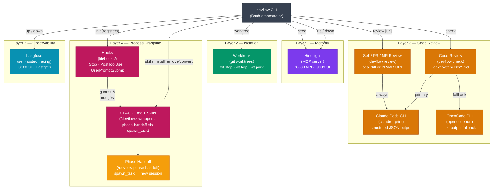
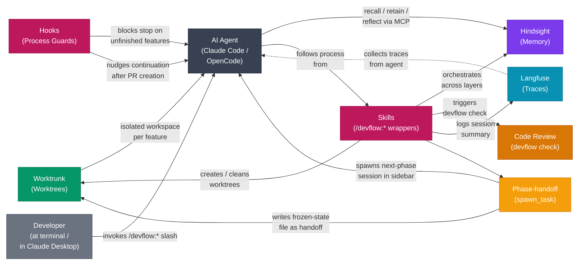

---
tags:
  [
    devflow,
    tooling,
    ai-development,
    hindsight,
    worktrunk,
    code-review,
    langfuse,
    skills,
    phase-handoff,
  ]
related: ["[[development-workflow]]"]
---

# Devflow Ecosystem — The 5-Layer AI Dev Environment

> Local-first AI development orchestrator. Each layer is an independent tool; devflow composes them.
> Related: [[development-workflow]]

---

## 1. Layer Overview

```mermaid
%%{init: {'flowchart': {'rankSpacing': 50, 'nodeSpacing': 30, 'diagramPadding': 15}}}%%
graph TD
    CLI["devflow CLI<br/>(Bash orchestrator)"]

    subgraph L1 [" Layer 1 — Memory "]
        HS["Hindsight<br/>(MCP server)<br/>:8888 API · :9999 UI"]
    end

    subgraph L2 [" Layer 2 — Isolation "]
        WT["Worktrunk<br/>(git worktrees)<br/>wt step · wt hop · wt park"]
    end

    subgraph L3 [" Layer 3 — Code Review "]
        CR["Code Review<br/>(devflow check)<br/>.devflow/checks/*.md"]
        RV["Self / PR / MR Review<br/>(devflow review)<br/>local diff or PR/MR URL"]
        CR_CLAUDE["Claude Code CLI<br/>(claude --print)<br/>structured JSON output"]
        CR_OPENCODE["OpenCode CLI<br/>(opencode run)<br/>text output fallback"]
        CR -->|"primary"| CR_CLAUDE
        CR -->|"fallback"| CR_OPENCODE
        RV -->|"always"| CR_CLAUDE
    end

    subgraph L4 [" Layer 4 — Process Discipline "]
        SK["CLAUDE.md + Skills<br/>(/devflow:* wrappers ·<br/>phase-handoff via spawn_task)"]
        HK["Hooks<br/>(lib/hooks/)<br/>Stop · PostToolUse · UserPromptSubmit"]
        PH["Phase Handoff<br/>(/devflow:phase-handoff)<br/>spawn_task → new session"]
    end

    subgraph L5 [" Layer 5 — Observability "]
        LF["Langfuse<br/>(self-hosted tracing)<br/>:3100 UI · Postgres"]
    end

    CLI -->|"up / down"| HS
    CLI -->|"up / down"| LF
    CLI -->|"worktree <ticket>"| WT
    CLI -->|"check"| CR
    CLI -->|"review [url]"| RV
    CLI -->|"skills install/remove/convert"| SK
    CLI -->|"init (registers)"| HK
    HK -->|"guards &<br/>nudges"| SK
    SK --> PH
    CLI -->|"seed"| HS

    classDef hindsightStyle fill:#7c3aed,color:#fff,stroke:#5b21b6
    classDef worktrunkStyle fill:#059669,color:#fff,stroke:#047857
    classDef reviewStyle fill:#d97706,color:#fff,stroke:#b45309
    classDef skillsStyle fill:#be185d,color:#fff,stroke:#9d174d
    classDef langfuseStyle fill:#0891b2,color:#fff,stroke:#0e7490
    classDef cliStyle fill:#374151,color:#fff,stroke:#1f2937
    classDef handoffStyle fill:#f59e0b,color:#fff,stroke:#d97706

    class HS hindsightStyle
    class WT worktrunkStyle
    class CR,RV,CR_CLAUDE,CR_OPENCODE reviewStyle
    class SK,HK skillsStyle
    class PH handoffStyle
    class LF langfuseStyle
    class CLI cliStyle
```

---

## 2. Cross-Layer Connections

```mermaid
%%{init: {'flowchart': {'rankSpacing': 50, 'nodeSpacing': 30, 'diagramPadding': 15}}}%%
graph LR
    HS["Hindsight<br/>(Memory)"]
    WT["Worktrunk<br/>(Worktrees)"]
    CR["Code Review<br/>(devflow check)"]
    SK["Skills<br/>(/devflow:* wrappers)"]
    LF["Langfuse<br/>(Traces)"]
    HK["Hooks<br/>(Process Guards)"]
    PH["Phase-handoff<br/>(spawn_task)"]
    AGENT["AI Agent<br/>(Claude Code /<br/>OpenCode)"]
    HUMAN["Developer<br/>(at terminal /<br/>in Claude Desktop)"]

    WT -->|"isolated workspace<br/>per feature"| AGENT
    AGENT -->|"recall / retain /<br/>reflect via MCP"| HS
    AGENT -->|"follows process<br/>from"| SK
    SK -->|"orchestrates<br/>across layers"| HS
    SK -->|"triggers<br/>devflow check"| CR
    SK -->|"creates / cleans<br/>worktrees"| WT
    SK -->|"logs session<br/>summary"| LF
    SK --> PH
    PH -->|"spawns next-phase<br/>session in sidebar"| AGENT
    PH -->|"writes frozen-state<br/>file as handoff"| WT
    HK -->|"blocks stop on<br/>unfinished features"| AGENT
    HK -->|"nudges continuation<br/>after PR creation"| AGENT
    LF -.->|"collects traces<br/>from agent"| AGENT
    HUMAN -->|"invokes /devflow:* slash"| AGENT

    classDef hindsightStyle fill:#7c3aed,color:#fff,stroke:#5b21b6
    classDef worktrunkStyle fill:#059669,color:#fff,stroke:#047857
    classDef reviewStyle fill:#d97706,color:#fff,stroke:#b45309
    classDef skillsStyle fill:#be185d,color:#fff,stroke:#9d174d
    classDef langfuseStyle fill:#0891b2,color:#fff,stroke:#0e7490
    classDef agentStyle fill:#374151,color:#fff,stroke:#1f2937
    classDef handoffStyle fill:#f59e0b,color:#fff,stroke:#d97706
    classDef humanStyle fill:#6b7280,color:#fff,stroke:#4b5563

    class HS hindsightStyle
    class WT worktrunkStyle
    class CR reviewStyle
    class SK,HK skillsStyle
    class LF langfuseStyle
    class AGENT agentStyle
    class PH handoffStyle
    class HUMAN humanStyle
```

---

## 3. Skill-to-Layer Mapping

Each skill is a `/devflow:*` slash command that orchestrates across multiple layers. Wrappers (`brainstorming`, `writing-plans`, `executing-plans`) delegate to upstream skills internally — devflow callers never reach past the wrappers.

| Skill                       | Layer | Touches             | What it does                                                                            |
| --------------------------- | ----- | ------------------- | --------------------------------------------------------------------------------------- |
| `/devflow:recall-before-task` | 1   | L1                  | Recall memories before starting a task                                                  |
| `/devflow:retain-learning`    | 1   | L1                  | Store a discovery into Hindsight                                                        |
| `/devflow:reflect-session`    | 1   | L1                  | End-of-session reflection and memory consolidation                                      |
| `/devflow:new-feature`        | 1   | L1                  | POST-LAUNCH setup guide for new feature workspace + invokes /devflow:brainstorming      |
| `/devflow:brainstorming`      | 4   | L4                  | Wrapper around upstream brainstorming; overrides terminal handoff to /devflow:spec-feature |
| `/devflow:spec-feature`       | 4   | L1 + L4             | Architecture recall + spec doc + task breakdown + phase-handoff to plan                 |
| `/devflow:writing-plans`      | 4   | L4                  | Wrapper around upstream writing-plans; phase-handoff to lock-tests at end               |
| `/devflow:lock-tests`         | 4   | L4                  | Batch failing test inventory + user-approval gate + phase-handoff to impl               |
| `/devflow:executing-plans`    | 4   | L4                  | Wrapper around upstream executing-plans; forces terminal handoff to /devflow:finish-feature |
| `/devflow:phase-handoff`      | 4   | L4 + L2             | Writes frozen-state file + spawn_task → new session with [TICKET] [MR#N] Phase title    |
| `/devflow:finish-feature`     | 3   | L3 + L1 + L4        | devflow check + PR/MR creation + viz check + retain learnings                           |
| `/devflow:pre-push-check`     | 3   | L3 + L4             | devflow check + CLAUDE.md compliance self-review                                        |
| `/devflow:create-pr`          | 3   | L3 + L1             | Self-review + devflow check + gh/glab pr create                                         |
| `/devflow:review`             | 3   | L3                  | Multi-perspective code review on local diff or PR/MR URL                                |
| `/devflow:review-document`    | 3   | L3                  | Prose-doc review (KB/RFC/spike/runbook/PRD) on Google Docs, Confluence, local files, URLs |
| `/devflow:architecture-decision` | 4 | L1 + L4             | ADR + Hindsight retention + CLAUDE.md update                                            |
| `/devflow:session-summary`    | 5   | L5 + L1             | Metrics, quality scores, Langfuse trace logging                                         |
| `/devflow:update-visualizations` | 4 | L4                 | Analyze diff + update affected diagrams                                                 |

---

## 4. Runtime Architecture

```mermaid
%%{init: {'flowchart': {'rankSpacing': 50, 'nodeSpacing': 30, 'diagramPadding': 15}}}%%
graph TD
    subgraph Docker ["Docker Compose (devflow up)"]
        HS_C["devflow-hindsight<br/>ghcr.io/vectorize-io/hindsight:latest<br/>:8888 API · :9999 UI"]
        LF_DB["devflow-langfuse-db<br/>postgres:15"]
        LF_WEB["devflow-langfuse-web<br/>langfuse/langfuse:2<br/>:3100 UI"]
        LF_DB --> LF_WEB
    end

    subgraph CLI_Tools ["Homebrew CLIs"]
        WT_C["worktrunk / wt<br/>(brew install)"]
        GH_C["gh<br/>(GitHub CLI)"]
        GLAB_C["glab<br/>(GitLab CLI)"]
    end

    subgraph Review ["Code Review (devflow check + devflow review)"]
        CR_C["devflow check<br/>(CLI dispatch)"]
        CR_CL["claude --print<br/>(primary · structured JSON)"]
        CR_OC["opencode run<br/>(fallback · text output)"]
        CR_C -->|"primary"| CR_CL
        CR_C -->|"fallback"| CR_OC
    end

    subgraph Config ["Config Files"]
        CLAUDE["~/.claude/CLAUDE.md<br/>(user-scoped agent config)"]
        AGENTS["~/.claude/AGENTS.md<br/>(symlink → CLAUDE.md)"]
        CHECKS[".devflow/checks/*.md<br/>(per-project review rules)"]
        TOML[".worktrunk.toml<br/>(per-project worktree config)"]
        SKILLS["~/.claude/commands/devflow/<br/>(symlinked plugin)"]
        HOOKS["lib/hooks/*.sh<br/>(Stop · PostToolUse ·<br/>UserPromptSubmit)"]
        SETTINGS["~/.claude/settings.json<br/>(hooks registration)"]
        STATE[".devflow/state/<branch>/<br/>(frozen-state files, gitignored)"]
    end

    CR_C -->|"reads rules from"| CHECKS
    WT_C -->|"reads config from"| TOML
    SKILLS -->|"orchestrate"| WT_C
    SKILLS -->|"orchestrate"| CR_C
    SKILLS -->|"orchestrate"| HS_C
    SKILLS -->|"orchestrate"| LF_WEB
    SKILLS -->|"write/read"| STATE
    SKILLS -->|"PR/MR via"| GH_C
    SKILLS -->|"PR/MR via"| GLAB_C
    HOOKS -->|"registered in"| SETTINGS

    classDef hindsightStyle fill:#7c3aed,color:#fff,stroke:#5b21b6
    classDef worktrunkStyle fill:#059669,color:#fff,stroke:#047857
    classDef reviewStyle fill:#d97706,color:#fff,stroke:#b45309
    classDef skillsStyle fill:#be185d,color:#fff,stroke:#9d174d
    classDef langfuseStyle fill:#0891b2,color:#fff,stroke:#0e7490
    classDef configStyle fill:#6b7280,color:#fff,stroke:#4b5563

    class HS_C hindsightStyle
    class WT_C,TOML,GH_C,GLAB_C worktrunkStyle
    class CR_C,CR_CL,CR_OC,CHECKS reviewStyle
    class LF_DB,LF_WEB langfuseStyle
    class CLAUDE,AGENTS,SKILLS,HOOKS,SETTINGS,STATE skillsStyle
```

---

## 5. devflow CLI Commands

| Command                             | What it orchestrates                                                                              | Layers |
| ----------------------------------- | ------------------------------------------------------------------------------------------------- | ------ |
| `devflow init [dir]`                | Full setup: install 5 tools, configure CLAUDE.md, AGENTS.md, project config, MCP, plugins, skills | All 5  |
| `devflow up`                        | Start Docker services (Hindsight + Langfuse)                                                      | L1, L5 |
| `devflow down`                      | Stop Docker services                                                                              | L1, L5 |
| `devflow restart`                   | Restart Docker services                                                                           | L1, L5 |
| `devflow status`                    | Health check across all 5 layers                                                                  | All 5  |
| `devflow seed [dir]`                | Seed Hindsight memory from project files                                                          | L1     |
| `devflow worktree <ticket>`         | Create worktree + branch-name enforcement + copy gitignored deps                                  | L2     |
| `devflow done <branch>`             | Cleanup worktree after PR/MR merge                                                                | L2     |
| `devflow check`                     | Run code review against .devflow/checks/ (Claude Code primary, OpenCode fallback)                 | L3     |
| `devflow review`                    | Review local diff against CLAUDE.md conventions via Claude Code                                   | L3, L4 |
| `devflow review <pr-url>`           | Fetch PR/MR diff (gh/glab) and review via Claude Code                                             | L3     |
| `/devflow:review-document <src>`    | Multi-perspective prose-doc review (KB/RFC/spike/runbook/PRD)                                     | L3     |
| `devflow skills list`               | List all skills from registry with install status                                                 | L4     |
| `devflow skills install <name>`     | Copy skill to .claude/commands/                                                                   | L4     |
| `devflow skills remove <name>`      | Delete skill from project                                                                         | L4     |
| `devflow skills convert`            | Convert skills to Claude Code plugin format (regenerate 3-tier mirrors)                           | L4     |
| `devflow watch [setup\|remove]`     | Sensitive file watchdog — cron + post-merge hook for staleness detection                          | L4     |
| `devflow check-version`             | Verify version consistency across Makefile, utils.sh, plugin.json, command badges                 | L4     |
| `devflow version-bump <version>`    | Bump version in all version-bearing files                                                         | L4     |
| `devflow release`                   | Preview next release (conventional commit analysis, dry-run)                                      | L4     |
