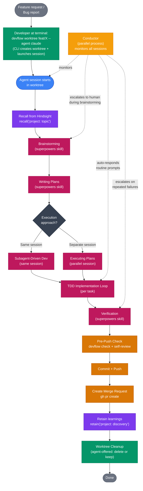
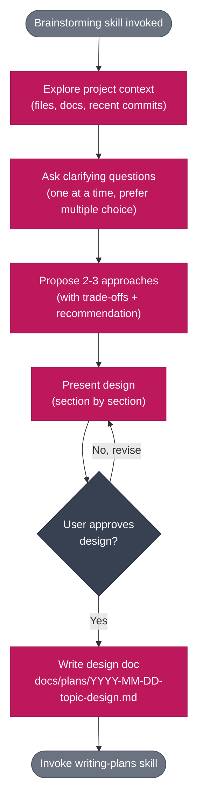
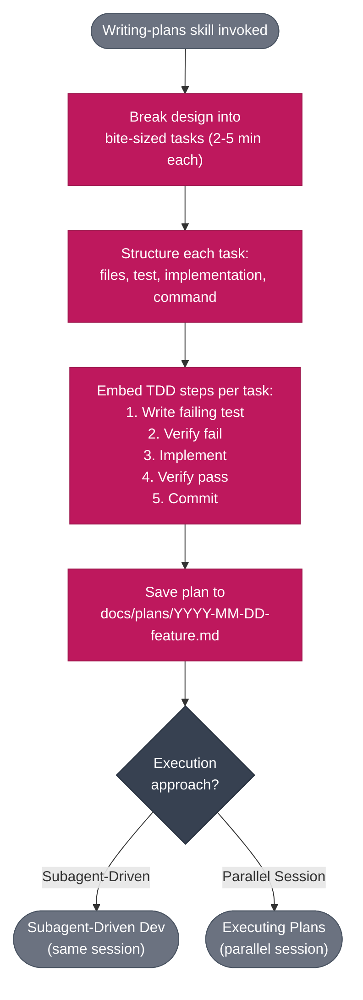
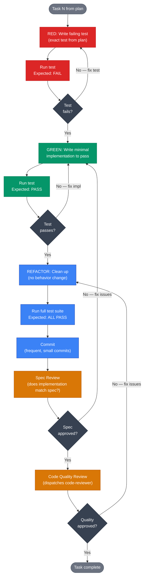

---
tags:
  [
    devflow,
    workflow,
    sdd,
    tdd,
    brainstorming,
    planning,
    code-review,
    merge-request,
    conductor,
  ]
related: ["[[devflow-ecosystem]]"]
---

# Development Workflow — From Idea to Merge Request

> The full SDD (Subagent-Driven Development) workflow using devflow's 6-layer toolchain.
> Related: [[devflow-ecosystem]]

---

## 1. High-Level Flow



---

## 2. Phase 1 — Brainstorming

> **Conductor note:** The Conductor escalates to the human during brainstorming — this phase is interactive and should not be auto-responded.



---

## 3. Phase 2 — Writing Plans



---

## 4. Phase 3 — TDD Implementation Loop (Per Task)

> **Conductor note:** The Conductor can auto-respond to routine prompts during this phase (e.g., confirming test runs, approving standard refactors). It escalates to the human when tests fail repeatedly.



---

## 5. Phase 4 — Finishing & Merge Request

This phase runs entirely inside the agent session: verification, devflow check, commit, visualization updates, PR description strategy, PR/MR creation, retain learnings, and optional worktree cleanup. Post-PR continuation is enforced by hooks (PostToolUse nudge + Stop hook PR detection + explicit skill instruction).

```mermaid
%%{init: {'flowchart': {'rankSpacing': 50, 'nodeSpacing': 30, 'diagramPadding': 15}}}%%
graph TD
    F_START(["All tasks complete"])

    subgraph AgentActions [" Agent Actions (inside session) "]
        F_VERIFY["Run full verification<br/>(tests, lint, build)"]
        F_PASS{"All<br/>pass?"}
        F_FIX["Fix failures"]
        F_CN["Pre-push check<br/>devflow check"]
        F_SELF["Self-review vs CLAUDE.md<br/>(naming, architecture, security)"]
        F_COMMIT["Commit changes"]
        F_VIZ{"Visualizations<br/>exist?"}
        F_VIZ_UPDATE["Check & update diagrams<br/>(analyze diff, propose updates)"]
        F_VIZ_COMMIT["Commit visualization updates"]
        F_PRSTRAT["Resolve PR description strategy<br/>(recall preference / ask user)"]
        F_CHECKPOINT["CHECKPOINT: Present diff<br/>(wait for user approval)"]
        F_PUSH["git push -u origin HEAD"]
        F_GH["Create PR/MR<br/>(gh pr create / glab mr create)"]
        F_RETAIN["Retain session learnings<br/>retain('project: ...')"]
        F_SUMMARY["Present feature summary"]
        F_CLEANUP_Q{"Worktree<br/>cleanup?"}
        F_DELETE["devflow done branch<br/>(delete worktree)"]
        F_KEEP["Keep for review feedback"]
    end

    F_DONE(["Done"])

    F_START --> F_VERIFY
    F_VERIFY --> F_PASS
    F_PASS -->|"No"| F_FIX
    F_FIX --> F_VERIFY
    F_PASS -->|"Yes"| F_CN
    F_CN --> F_SELF
    F_SELF --> F_COMMIT
    F_COMMIT --> F_VIZ
    F_VIZ -->|"No"| F_PRSTRAT
    F_VIZ -->|"Yes"| F_VIZ_UPDATE
    F_VIZ_UPDATE --> F_VIZ_COMMIT
    F_VIZ_COMMIT --> F_PRSTRAT
    F_PRSTRAT --> F_CHECKPOINT
    F_CHECKPOINT --> F_PUSH
    F_PUSH --> F_GH
    F_GH --> F_RETAIN
    F_RETAIN --> F_SUMMARY
    F_SUMMARY --> F_CLEANUP_Q
    F_CLEANUP_Q -->|"Delete now"| F_DELETE
    F_CLEANUP_Q -->|"Keep"| F_KEEP
    F_DELETE --> F_DONE
    F_KEEP --> F_DONE

    classDef verifyStyle fill:#059669,color:#fff,stroke:#047857
    classDef reviewStyle fill:#d97706,color:#fff,stroke:#b45309
    classDef hindsightStyle fill:#7c3aed,color:#fff,stroke:#5b21b6
    classDef langfuseStyle fill:#0891b2,color:#fff,stroke:#0e7490
    classDef worktrunkStyle fill:#059669,color:#fff,stroke:#047857
    classDef decisionStyle fill:#374151,color:#fff,stroke:#1f2937
    classDef terminalStyle fill:#6b7280,color:#fff,stroke:#4b5563
    classDef skillsStyle fill:#be185d,color:#fff,stroke:#9d174d

    class F_VERIFY,F_PASS,F_FIX verifyStyle
    class F_CN,F_SELF,F_PUSH,F_GH,F_COMMIT,F_CHECKPOINT reviewStyle
    class F_RETAIN hindsightStyle
    class F_SUMMARY langfuseStyle
    class F_DELETE,F_KEEP worktrunkStyle
    class F_PASS,F_VIZ,F_CLEANUP_Q decisionStyle
    class F_START,F_DONE terminalStyle
    class F_VIZ_UPDATE,F_VIZ_COMMIT,F_PRSTRAT skillsStyle
```



---

## 6. Tool Active at Each Phase

| Phase              |   Hindsight (L1)    | Agent Deck (L2) | Conductor (L2) |   Worktrunk (L3)   | Code Review (L4)  |  Skills (L5)   |  Langfuse (L6)  |
| ------------------ | :-----------------: | :-------------: | :------------: | :----------------: | :---------------: | :------------: | :-------------: |
| **Start (CLI)**    |          —          |  wraps session  |       —        |  create worktree   |         —         |       —        |        —        |
| **Recall (Agent)** |       recall        |        —        |    monitors    |         —          |         —         |       —        |     traces      |
| **Brainstorming**  |   recall context    |        —        |   escalates    |         —          |         —         | brainstorming  |     traces      |
| **Writing Plans**  |          —          |        —        |    monitors    |         —          |         —         | writing-plans  |     traces      |
| **TDD Loop**       | retain discoveries  |        —        | auto-responds  | isolated workspace |         —         |    TDD, SDD    |     traces      |
| **Spec Review**    |          —          |        —        | auto-responds  |         —          |         —         | spec-reviewer  |     traces      |
| **Quality Review** |          —          |        —        | auto-responds  |         —          |         —         | code-reviewer  |     traces      |
| **Pre-Push**       |          —          |        —        |    monitors    |         —          |  devflow check    | pre-push-check |     traces      |
| **Create MR**      | context for PR body |        —        |    monitors    |         —          |         —         |   create-pr    |     traces      |
| **Viz Check**      |          —          |        —        |    monitors    |         —          |         —         | finish-feature |        —        |
| **PR Strategy**    |  recall preference  |        —        |    monitors    |         —          |         —         | finish-feature |        —        |
| **Create MR**      | context for PR body |        —        |    monitors    |         —          |         —         | finish-feature |     traces      |
| **Finish (Agent)** |  retain learnings   |        —        |    monitors    |         —          |         —         | finish-feature | session-summary |
| **Cleanup (Agent)**|          —          |        —        |       —        |    devflow done    |         —         | finish-feature |        —        |

---

## 7. Entry Points

There are two ways to start a devflow development session:

### Recommended: `devflow worktree`

```bash
devflow worktree feat/X --agent claude
```

- Uses **worktrunk** under the hood for worktree creation
- Runs `wt step copy-ignored` to copy `.env`, `node_modules`, and other gitignored files
- Launches an agent-deck session in the new worktree
- Single command from idea to working agent session

### Alternative: `agent-deck add`

```bash
agent-deck add . -c claude --worktree feat/X -b
```

- Atomic command — creates worktree + session in one step
- Does **not** run `copy-ignored` (no `.env`, `node_modules` in new worktree)
- Useful when you don't need gitignored files (e.g., pure documentation work)
- `-b` flag runs session in background
