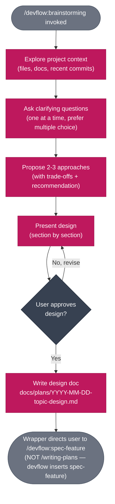
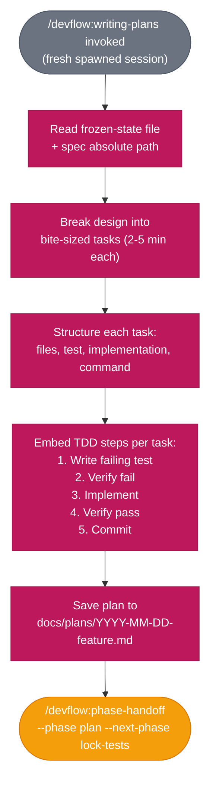
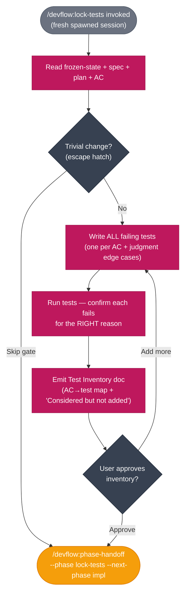
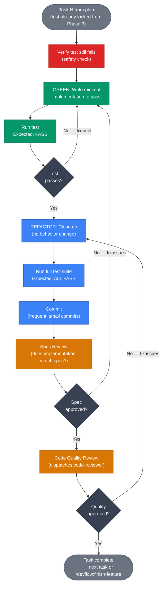

---
tags:
  [
    devflow,
    workflow,
    sdd,
    tdd,
    brainstorming,
    planning,
    code-review,
    merge-request,
    phase-handoff,
  ]
related: ["[[devflow-ecosystem]]"]
---

# Development Workflow — From Idea to Merge Request

> The full SDD (Spec-Driven Development) workflow using devflow's 5-layer toolchain and the `/devflow:*` wrapper convention.
> Related: [[devflow-ecosystem]]

---

## 1. High-Level Flow


```mermaid
%%{init: {'flowchart': {'rankSpacing': 50, 'nodeSpacing': 30, 'diagramPadding': 15}}}%%
graph TD
    START(["Feature request /<br/>Bug report"])
    WORKTREE["Developer at terminal:<br/>devflow worktree TICKET-N<br/>(CLI creates worktree + opens session)"]
    SESSION(["Agent session starts<br/>in worktree"])
    NEWFEAT["/devflow:new-feature<br/>(recall, scope-check, walkthrough?)"]
    BRAIN["/devflow:brainstorming<br/>(wraps upstream brainstorming)"]
    SPEC["/devflow:spec-feature<br/>(write spec doc + tasks)"]
    HANDOFF1["/devflow:phase-handoff<br/>--phase spec --next-phase plan<br/>(spawn new session)"]
    PLAN["/devflow:writing-plans<br/>(spawned session — wraps upstream)"]
    HANDOFF2["/devflow:phase-handoff<br/>--phase plan --next-phase lock-tests"]
    LOCK["/devflow:lock-tests<br/>(spawned session — batch failing tests + gate)"]
    HANDOFF3["/devflow:phase-handoff<br/>--phase lock-tests --next-phase impl"]
    EXEC["/devflow:executing-plans<br/>(spawned session — wraps upstream + forces finish)"]
    LOOP["TDD Implementation Loop<br/>(per task — RED, GREEN, REFACTOR)"]
    FINISH["/devflow:finish-feature<br/>(verify + PR + retain + cleanup)"]
    DONE(["Done"])

    START --> WORKTREE
    WORKTREE --> SESSION
    SESSION --> NEWFEAT
    NEWFEAT --> BRAIN
    BRAIN --> SPEC
    SPEC --> HANDOFF1
    HANDOFF1 --> PLAN
    PLAN --> HANDOFF2
    HANDOFF2 --> LOCK
    LOCK --> HANDOFF3
    HANDOFF3 --> EXEC
    EXEC --> LOOP
    LOOP --> FINISH
    FINISH --> DONE

    classDef hindsightStyle fill:#7c3aed,color:#fff,stroke:#5b21b6
    classDef worktrunkStyle fill:#059669,color:#fff,stroke:#047857
    classDef skillsStyle fill:#be185d,color:#fff,stroke:#9d174d
    classDef reviewStyle fill:#d97706,color:#fff,stroke:#b45309
    classDef handoffStyle fill:#f59e0b,color:#fff,stroke:#d97706
    classDef decisionStyle fill:#374151,color:#fff,stroke:#1f2937
    classDef terminalStyle fill:#6b7280,color:#fff,stroke:#4b5563

    class WORKTREE worktrunkStyle
    class NEWFEAT,BRAIN,SPEC,PLAN,LOCK,EXEC,LOOP,FINISH skillsStyle
    class HANDOFF1,HANDOFF2,HANDOFF3 handoffStyle
    class START,SESSION,DONE terminalStyle
```

> **Phase-handoff spawns a new Claude Desktop session** (`mcp__ccd_session__spawn_task`) with a deterministic title `[<TICKET>] [MR#<N>] <Phase>`. The new session is cold — its only context is the prompt the handoff hands it (leading with the next-phase slash command + absolute artefact paths). The prior session stays open as an archive.

---

## 2. Phase 1 — Brainstorming

> `/devflow:brainstorming` is devflow's wrapper around the upstream brainstorming skill. It pass-through-delegates to the upstream HARD-GATE design loop, then OVERRIDES the upstream's terminal handoff so it leads to `/devflow:spec-feature` (devflow inserts spec-feature between brainstorming and writing-plans).


```mermaid
%%{init: {'flowchart': {'rankSpacing': 50, 'nodeSpacing': 30, 'diagramPadding': 15}}}%%
graph TD
    B_START(["/devflow:brainstorming invoked"])
    B_CTX["Explore project context<br/>(files, docs, recent commits)"]
    B_Q["Ask clarifying questions<br/>(one at a time, prefer multiple choice)"]
    B_APPROACH["Propose 2-3 approaches<br/>(with trade-offs + recommendation)"]
    B_DESIGN["Present design<br/>(section by section)"]
    B_OK{"User approves<br/>design?"}
    B_DOC["Write design doc<br/>docs/plans/YYYY-MM-DD-topic-design.md"]
    B_NEXT(["Wrapper directs user to /devflow:spec-feature<br/>(NOT /writing-plans — devflow inserts spec-feature)"])

    B_START --> B_CTX
    B_CTX --> B_Q
    B_Q --> B_APPROACH
    B_APPROACH --> B_DESIGN
    B_DESIGN --> B_OK
    B_OK -->|"No, revise"| B_DESIGN
    B_OK -->|"Yes"| B_DOC
    B_DOC --> B_NEXT

    classDef skillsStyle fill:#be185d,color:#fff,stroke:#9d174d
    classDef decisionStyle fill:#374151,color:#fff,stroke:#1f2937
    classDef terminalStyle fill:#6b7280,color:#fff,stroke:#4b5563

    class B_CTX,B_Q,B_APPROACH,B_DESIGN,B_DOC skillsStyle
    class B_OK decisionStyle
    class B_START,B_NEXT terminalStyle
```

---

## 3. Phase 2 — Writing Plans

> `/devflow:writing-plans` is devflow's wrapper around the upstream writing-plans skill. It runs in a fresh spawned session after `phase-handoff` from spec-feature. Its only context is the frozen-state file + spec absolute path handed by the handoff prompt.


```mermaid
%%{init: {'flowchart': {'rankSpacing': 50, 'nodeSpacing': 30, 'diagramPadding': 15}}}%%
graph TD
    P_START(["/devflow:writing-plans invoked<br/>(fresh spawned session)"])
    P_READ["Read frozen-state file<br/>+ spec absolute path"]
    P_BREAK["Break design into<br/>bite-sized tasks (2-5 min each)"]
    P_STRUCT["Structure each task:<br/>files, test, implementation, command"]
    P_TDD["Embed TDD steps per task:<br/>1. Write failing test<br/>2. Verify fail<br/>3. Implement<br/>4. Verify pass<br/>5. Commit"]
    P_SAVE["Save plan to<br/>docs/plans/YYYY-MM-DD-feature.md"]
    P_HANDOFF(["/devflow:phase-handoff<br/>--phase plan --next-phase lock-tests"])

    P_START --> P_READ
    P_READ --> P_BREAK
    P_BREAK --> P_STRUCT
    P_STRUCT --> P_TDD
    P_TDD --> P_SAVE
    P_SAVE --> P_HANDOFF

    classDef skillsStyle fill:#be185d,color:#fff,stroke:#9d174d
    classDef handoffStyle fill:#f59e0b,color:#fff,stroke:#d97706
    classDef terminalStyle fill:#6b7280,color:#fff,stroke:#4b5563

    class P_READ,P_BREAK,P_STRUCT,P_TDD,P_SAVE skillsStyle
    class P_HANDOFF handoffStyle
    class P_START terminalStyle
```

---

## 4. Phase 3 — Lock Tests (Batch Failing Test Inventory)

> `/devflow:lock-tests` reads spec + plan + AC, writes ALL failing tests up-front (one per AC + judgment-driven edge cases), emits a Test Inventory document with a `## Considered but not added` section, then gates with `AskUserQuestion` before any implementation begins.


```mermaid
%%{init: {'flowchart': {'rankSpacing': 50, 'nodeSpacing': 30, 'diagramPadding': 15}}}%%
graph TD
    L_START(["/devflow:lock-tests invoked<br/>(fresh spawned session)"])
    L_READ["Read frozen-state + spec + plan + AC"]
    L_TRIVIAL{"Trivial change?<br/>(escape hatch)"}
    L_BATCH["Write ALL failing tests<br/>(one per AC + judgment edge cases)"]
    L_VERIFY["Run tests — confirm each fails<br/>for the RIGHT reason"]
    L_INV["Emit Test Inventory doc<br/>(AC→test map + 'Considered but not added')"]
    L_GATE{"User approves<br/>inventory?"}
    L_HANDOFF(["/devflow:phase-handoff<br/>--phase lock-tests --next-phase impl"])

    L_START --> L_READ
    L_READ --> L_TRIVIAL
    L_TRIVIAL -->|"Skip gate"| L_HANDOFF
    L_TRIVIAL -->|"No"| L_BATCH
    L_BATCH --> L_VERIFY
    L_VERIFY --> L_INV
    L_INV --> L_GATE
    L_GATE -->|"Add more"| L_BATCH
    L_GATE -->|"Approve"| L_HANDOFF

    classDef skillsStyle fill:#be185d,color:#fff,stroke:#9d174d
    classDef decisionStyle fill:#374151,color:#fff,stroke:#1f2937
    classDef handoffStyle fill:#f59e0b,color:#fff,stroke:#d97706
    classDef terminalStyle fill:#6b7280,color:#fff,stroke:#4b5563

    class L_READ,L_BATCH,L_VERIFY,L_INV skillsStyle
    class L_TRIVIAL,L_GATE decisionStyle
    class L_HANDOFF handoffStyle
    class L_START terminalStyle
```

---

## 5. Phase 4 — TDD Implementation Loop (Per Task)

> `/devflow:executing-plans` is devflow's wrapper around the upstream executing-plans skill. The wrapper delegates the per-task red-green-refactor loop to the upstream flow AND intercepts the terminal handoff so it goes to `/devflow:finish-feature` (NOT upstream `finishing-a-development-branch`).


```mermaid
%%{init: {'flowchart': {'rankSpacing': 50, 'nodeSpacing': 30, 'diagramPadding': 15}}}%%
graph TD
    T_START(["Task N from plan<br/>(test already locked from Phase 3)"])
    T_VERIFY_RED["Verify test still fails<br/>(safety check)"]
    T_GREEN["GREEN: Write minimal<br/>implementation to pass"]
    T_RUN["Run test<br/>Expected: PASS"]
    T_PASS{"Test<br/>passes?"}
    T_REFACTOR["REFACTOR: Clean up<br/>(no behavior change)"]
    T_RUN_ALL["Run full test suite<br/>Expected: ALL PASS"]
    T_COMMIT["Commit<br/>(frequent, small commits)"]
    T_SPEC["Spec Review<br/>(does implementation match spec?)"]
    T_SPEC_OK{"Spec<br/>approved?"}
    T_QUALITY["Code Quality Review<br/>(dispatches code-reviewer)"]
    T_QUALITY_OK{"Quality<br/>approved?"}
    T_DONE(["Task complete<br/>→ next task or /devflow:finish-feature"])

    T_START --> T_VERIFY_RED
    T_VERIFY_RED --> T_GREEN
    T_GREEN --> T_RUN
    T_RUN --> T_PASS
    T_PASS -->|"No — fix impl"| T_GREEN
    T_PASS -->|"Yes"| T_REFACTOR
    T_REFACTOR --> T_RUN_ALL
    T_RUN_ALL --> T_COMMIT
    T_COMMIT --> T_SPEC
    T_SPEC --> T_SPEC_OK
    T_SPEC_OK -->|"No — fix issues"| T_GREEN
    T_SPEC_OK -->|"Yes"| T_QUALITY
    T_QUALITY --> T_QUALITY_OK
    T_QUALITY_OK -->|"No — fix issues"| T_REFACTOR
    T_QUALITY_OK -->|"Yes"| T_DONE

    classDef redStyle fill:#dc2626,color:#fff,stroke:#b91c1c
    classDef greenStyle fill:#059669,color:#fff,stroke:#047857
    classDef refactorStyle fill:#3b82f6,color:#fff,stroke:#1e40af
    classDef reviewStyle fill:#d97706,color:#fff,stroke:#b45309
    classDef decisionStyle fill:#374151,color:#fff,stroke:#1f2937
    classDef terminalStyle fill:#6b7280,color:#fff,stroke:#4b5563

    class T_VERIFY_RED redStyle
    class T_GREEN,T_RUN greenStyle
    class T_REFACTOR,T_RUN_ALL,T_COMMIT refactorStyle
    class T_SPEC,T_QUALITY reviewStyle
    class T_PASS,T_SPEC_OK,T_QUALITY_OK decisionStyle
    class T_START,T_DONE terminalStyle
```

---

## 6. Phase 5 — Finishing & Merge Request

This phase runs entirely inside the implementation spawned session: verification, devflow check, commit, visualization updates, PR description strategy, PR/MR creation, retain learnings, and optional worktree cleanup. Post-PR continuation is enforced by hooks (PostToolUse nudge + Stop hook PR detection + explicit skill instruction).


```mermaid
%%{init: {'flowchart': {'rankSpacing': 50, 'nodeSpacing': 30, 'diagramPadding': 15}}}%%
graph TD
    F_START(["All tasks complete<br/>(triggered by executing-plans wrapper)"])

    subgraph AgentActions [" Agent Actions (inside session) "]
        F_VERIFY["Run full verification<br/>(tests, lint, build)"]
        F_PASS{"All<br/>pass?"}
        F_FIX["Fix failures"]
        F_CN["Pre-push check<br/>devflow check"]
        F_SELF["Self-review vs CLAUDE.md<br/>(naming, architecture, security)"]
        F_COMMIT["Commit changes"]
        F_VIZ{"Visualizations<br/>exist?"}
        F_VIZ_UPDATE["Check & update diagrams<br/>(analyze diff, propose updates)"]
        F_VIZ_COMMIT["Commit visualization updates"]
        F_PRSTRAT["Resolve PR description strategy<br/>(recall preference / ask user)"]
        F_CHECKPOINT["CHECKPOINT: Present diff<br/>(wait for user approval)"]
        F_PUSH["git push -u origin HEAD"]
        F_GH["Create PR/MR<br/>(gh pr create / glab mr create)"]
        F_RETAIN["Retain session learnings<br/>retain('project: ...')"]
        F_SUMMARY["Present feature summary"]
        F_CLEANUP_Q{"Worktree<br/>cleanup?"}
        F_DELETE["devflow done branch<br/>(delete worktree)"]
        F_KEEP["Keep for review feedback"]
    end

    F_DONE(["Done"])

    F_START --> F_VERIFY
    F_VERIFY --> F_PASS
    F_PASS -->|"No"| F_FIX
    F_FIX --> F_VERIFY
    F_PASS -->|"Yes"| F_CN
    F_CN --> F_SELF
    F_SELF --> F_COMMIT
    F_COMMIT --> F_VIZ
    F_VIZ -->|"No"| F_PRSTRAT
    F_VIZ -->|"Yes"| F_VIZ_UPDATE
    F_VIZ_UPDATE --> F_VIZ_COMMIT
    F_VIZ_COMMIT --> F_PRSTRAT
    F_PRSTRAT --> F_CHECKPOINT
    F_CHECKPOINT --> F_PUSH
    F_PUSH --> F_GH
    F_GH --> F_RETAIN
    F_RETAIN --> F_SUMMARY
    F_SUMMARY --> F_CLEANUP_Q
    F_CLEANUP_Q -->|"Delete now"| F_DELETE
    F_CLEANUP_Q -->|"Keep"| F_KEEP
    F_DELETE --> F_DONE
    F_KEEP --> F_DONE

    classDef verifyStyle fill:#059669,color:#fff,stroke:#047857
    classDef reviewStyle fill:#d97706,color:#fff,stroke:#b45309
    classDef hindsightStyle fill:#7c3aed,color:#fff,stroke:#5b21b6
    classDef langfuseStyle fill:#0891b2,color:#fff,stroke:#0e7490
    classDef worktrunkStyle fill:#059669,color:#fff,stroke:#047857
    classDef decisionStyle fill:#374151,color:#fff,stroke:#1f2937
    classDef terminalStyle fill:#6b7280,color:#fff,stroke:#4b5563
    classDef skillsStyle fill:#be185d,color:#fff,stroke:#9d174d

    class F_VERIFY,F_FIX verifyStyle
    class F_CN,F_SELF,F_PUSH,F_GH,F_COMMIT,F_CHECKPOINT reviewStyle
    class F_RETAIN hindsightStyle
    class F_SUMMARY langfuseStyle
    class F_DELETE,F_KEEP worktrunkStyle
    class F_PASS,F_VIZ,F_CLEANUP_Q decisionStyle
    class F_START,F_DONE terminalStyle
    class F_VIZ_UPDATE,F_VIZ_COMMIT,F_PRSTRAT skillsStyle
```

---

## 7. Tool Active at Each Phase

| Phase             | Hindsight (L1)      | Worktrunk (L2)     | Code Review (L3) | Skills (L4)              | Langfuse (L5)   |
| ----------------- | :-----------------: | :----------------: | :--------------: | :----------------------: | :-------------: |
| **Start (CLI)**   |          —          | create worktree    |        —         | —                        |        —        |
| **new-feature**   | recall context      |         —          |        —         | /devflow:new-feature     |     traces      |
| **brainstorming** | recall context      |         —          |        —         | /devflow:brainstorming   |     traces      |
| **spec-feature**  | recall + retain     |         —          |        —         | /devflow:spec-feature    |     traces      |
| **writing-plans** | retain decisions    |         —          |        —         | /devflow:writing-plans   |     traces      |
| **lock-tests**    | retain decisions    |         —          |        —         | /devflow:lock-tests      |     traces      |
| **TDD Loop**      | retain discoveries  | isolated workspace |  spec/quality    | /devflow:executing-plans |     traces      |
| **Pre-Push**      | —                   |         —          |  devflow check   | /devflow:pre-push-check  |     traces      |
| **Finish + MR**   | retain learnings    |    devflow done    |        —         | /devflow:finish-feature  | session-summary |

---

## 8. Entry Point

There is one canonical way to start a devflow development session:

```bash
devflow worktree TICKET-N
```

- Uses **worktrunk** under the hood for worktree creation
- Branch-name enforcement: ticket-shaped names pass through, free-form names are prefixed `feat/`
- Worktree lands at `~/dev/.worktrees/<repo>/<branch-slug>`
- Open a Claude Code session in the new worktree → invoke `/devflow:new-feature` as the first command
